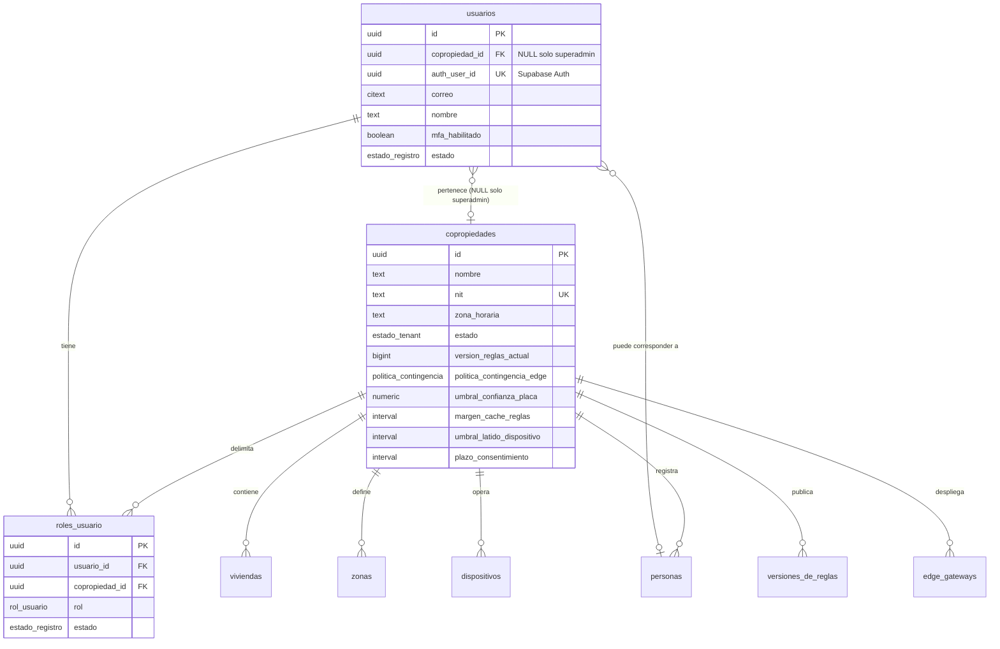
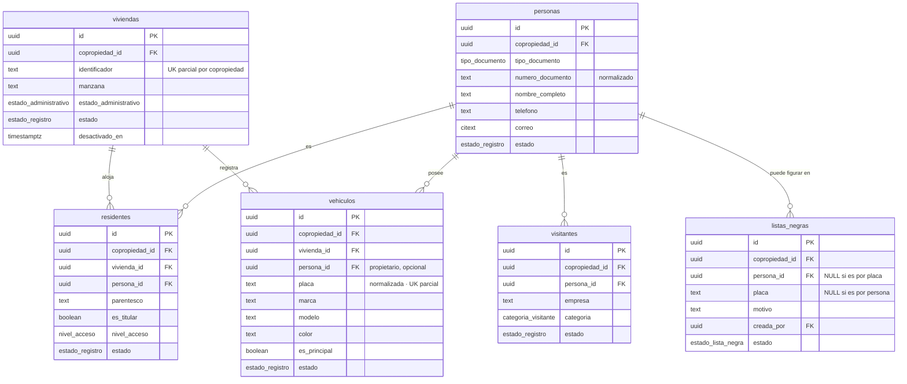
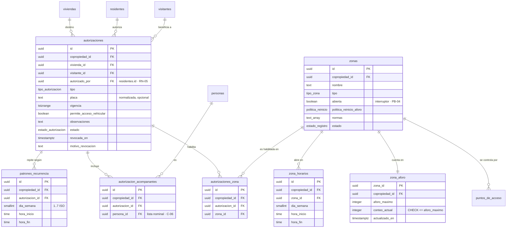
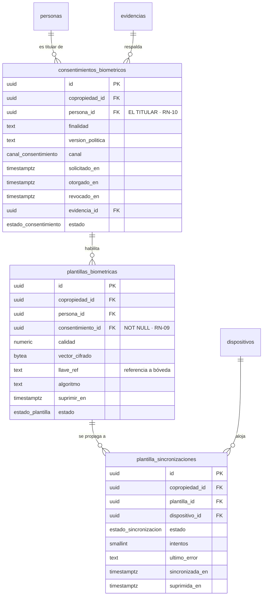
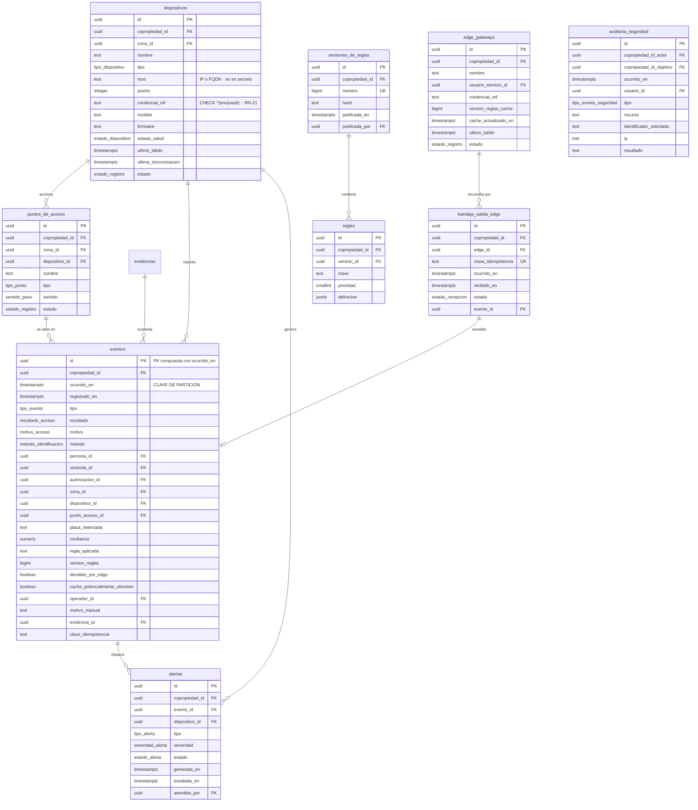

# Modelo de datos

> **Diseño aprobado el 2026-09-06 e implementado en la ETAPA 01-B.**
> Este documento es la referencia de diseño; el esquema ejecutable vive en
> `supabase/migrations/`. Ambos se mantienen sincronizados: si divergen, manda
> la migración y este documento se corrige.
>
> **Actualización del 2026-09-06 · política de retención resuelta.** El usuario
> fijó los plazos (eventos 24 meses, evidencia 90 días, plantillas ligadas a la
> vigencia de su autorización), **sujetos a confirmación legal de Grupo Control**.
> Se implementaron como columnas configurables por copropiedad más el libro
> `purgas_retencion`, con lo que las tablas suben a **31** y los enumerados a
> **31**. Ver decisión **D-21**.
>
> **Cambios introducidos por las decisiones del usuario al aprobar 01-A:**
> **P-11** — `nivel_acceso` deja de ser enumerado y pasa a ser el catálogo
> `niveles_acceso` (§6.2), con lo que las tablas suben de 29 a **30** y los
> enumerados bajan de 31 a **30**. **D-18** — `FUERA_DE_HORARIO` aprobado y
> añadido a `CLAUDE.md` §2.4. **S-09** — precisado: el corte de medianoche
> **no** reinicia el contador de aforo.

- **Rama:** `etapa-01-modelo-datos-supabase` · **Base:** `develop`
- **Fecha de diseño:** 2026-09-06 · **Aprobado e implementado:** 2026-09-06

---

## §1. Principio de derivación

**El esquema se deriva de los agregados, no de las pantallas.** Es la instrucción explícita de `CLAUDE.md` §6, y tiene una consecuencia práctica que conviene enunciar antes de la primera tabla: hay pantallas del mockup que no producen tabla —la columna «TIPO» de vehículos es una proyección de lectura, no un campo— y hay tablas que ninguna pantalla muestra —`bandeja_salida_edge`, `versiones_de_reglas`, `auditoria_seguridad`—.

El objetivo declarado de la etapa es **hacer estructuralmente imposible violar las reglas de negocio**. La prueba de si una regla está bien implementada no es «¿el código la respeta?», sino «¿podría violarla alguien con acceso directo a la base?». Cuando la respuesta es sí, la regla está en el sitio equivocado.

Tres niveles de garantía, en orden de fuerza:

| Nivel | Mecanismo | Ejemplo | Se puede eludir |
|---|---|---|---|
| **1 · Estructural** | Tipo, `NOT NULL`, `CHECK`, `UNIQUE`, clave foránea, permisos | Una plantilla biométrica no puede existir sin fila de consentimiento | No, salvo cambiando el esquema |
| **2 · Procedural en base** | Trigger, función `SECURITY INVOKER`, política RLS | Impedir el `DELETE` de un residente con historial | Sí, con privilegio de DDL — pero deja rastro |
| **3 · Aplicación** | Invariante del agregado, guard, caso de uso | Precedencia de la lista negra sobre la vigencia | Sí, por cualquier ruta que no pase por el caso de uso |

**Regla de asignación:** toda invariante que pueda violarse por concurrencia o por acceso directo va al nivel 1. El nivel 3 no sustituye al 1; lo acompaña, porque es donde la regla se lee y se entiende.

---

## §2. Los nueve agregados y su traducción a tablas

La ETAPA 00 estableció, resolviendo `[CONTRADICCIÓN]` **C-02**, que el diagrama arquitectónico declara **nueve** agregados raíz y no los seis que resume `CLAUDE.md` §2.2. Este esquema los materializa. Uno por uno, con la justificación de por qué cada uno es raíz —es decir, por qué es frontera de consistencia transaccional y no una entidad dentro de otro agregado—.

### 2.1 `Copropiedad` → `copropiedades`

**Por qué es raíz.** Es la **frontera del tenant** (RN-15). Nada existe fuera de una copropiedad, y ninguna transacción cruza de una a otra. Su invariante —«frontera de aislamiento»— no es un campo: es la razón de ser de la columna `copropiedad_id` en todas las demás tablas.

**Decisión de diseño relevante:** además de identidad, este agregado guarda la **configuración operativa por copropiedad**. Los siete supuestos que la ETAPA 00 dejó abiertos (`S-02` a `S-07`) aterrizan aquí como **columnas configurables**, no como constantes en el código. Un umbral de confianza escondido en una constante es un supuesto que nadie puede revisar; una columna con valor por defecto es un supuesto que el administrador puede corregir sin desplegar.

### 2.2 `Vivienda` → `viviendas` + `residentes` + `vehiculos`

**Por qué es raíz.** Sus invariantes cruzan las tres tablas: «una placa activa por vivienda» (RN-04) y «vivienda inactiva no genera nuevas autorizaciones» (RN-13). Residentes y vehículos **no** son raíces: no tienen ciclo de vida independiente de la vivienda, y desactivar la vivienda propaga estado hacia ellos.

**Consecuencia transaccional:** registrar un vehículo y verificar la unicidad de su placa ocurren en la misma transacción, sobre la misma frontera. Por eso el índice único parcial (ADR-004) es la garantía correcta y un `SELECT` previo no lo es.

### 2.3 `Autorizacion` → `autorizaciones` + `patrones_recurrencia` + `autorizacion_acompanantes` + `autorizaciones_zona`

**Por qué es raíz.** Tiene ciclo de vida propio —se crea, se revoca, expira— **independiente de la vivienda**: RN-13 dice literalmente que una vivienda inactiva conserva sus autorizaciones vigentes hasta su vencimiento. Si `Autorizacion` fuera parte del agregado `Vivienda`, desactivar la vivienda tendría que decidir qué hacer con ellas dentro de la misma frontera; siendo raíz, cada una vive su vigencia.

**Su invariante propia** —«solo hacia la propia vivienda» (RN-05)— se expresa como clave foránea obligatoria a `viviendas` más la restricción de que quien autoriza sea residente **de esa** vivienda.

### 2.4 `Acceso` → `eventos`

**Por qué es raíz.** Es el registro inmutable de un intento evaluado. Su invariante —«INMUTABLE, sin setters» (RN-03)— sería imposible de sostener si fuera parte de otro agregado, porque cualquier operación sobre el padre podría arrastrarlo.

**La invariante no se implementa con código.** Se implementa con `REVOKE UPDATE, DELETE` (ADR-005). El agregado sin setters expresa la regla; los permisos la garantizan.

### 2.5 `ConsentimientoBiometrico` → `consentimientos_biometricos`

**Por qué es raíz, y por qué separado de la plantilla.** El consentimiento **pertenece al titular** y puede revocarse en cualquier momento (RN-10, HU-15). La plantilla pertenece al sistema y se suprime *como consecuencia*. Fundirlos haría inexpresable el estado transitorio que RN-11 obliga a cerrar en menos de 24 horas: «consentimiento revocado, plantilla aún presente en la terminal».

Ese estado transitorio no es una anomalía a evitar: es el estado que el sistema debe **poder observar** para poder cerrarlo y demostrar que lo cerró.

### 2.6 `PlantillaBiometrica` → `plantillas_biometricas` + `plantilla_sincronizaciones`

**Por qué es raíz.** Ciclo de vida propio con supresión programada. La tabla hija existe porque una plantilla se sincroniza a **varias** terminales y CA-10 exige demostrar que «no existe en **ninguna** terminal»: sin registro por terminal, esa afirmación no es verificable.

### 2.7 `Zona` → `zonas` + `zona_horarios` + `zona_aforo`

**Por qué es raíz.** Su invariante —«el aforo nunca supera el máximo» (RN-14)— es de consistencia inmediata y alta concurrencia. El contador se separa en su propia tabla por una razón que se explica en §7, decisión D-04, y que no es cosmética.

### 2.8 `ListaNegra` → `listas_negras`

**Por qué es raíz** *(agregado que `CLAUDE.md` §2.2 no listaba)*. Dos invariantes que no tienen dónde vivir si no lo es:
- **RN-06** — precedencia absoluta sobre cualquier autorización vigente. `PolíticaListaNegra` *aplica* la lista; no la gobierna.
- **RN-07** — solo administrador u operador de central pueden crear o levantar una entrada. Eso es una regla sobre **quién cambia el estado del agregado**, que es la definición de invariante de agregado.

### 2.9 `Dispositivo` → `dispositivos` + `puntos_de_acceso`

**Por qué es raíz** *(agregado que `CLAUDE.md` §2.2 no listaba)*. Tres invariantes:
- **RN-21** — «la credencial nunca en claro». Es una invariante de este agregado y de ningún otro.
- **RN-12** — «no decide accesos, solo ejecuta». Es la traducción del principio rector a la capa de datos.
- **CA-26** — estado y latido: sin agregado no hay dónde guardar `ultimo_latido` ni desde dónde emitir el evento de degradación.

`puntos_de_acceso` es entidad interna, no raíz: un relé puede comandar dos puntos, y una cámara LPR alimenta un punto sin accionarlo. Separarlos permite que el evento referencie **qué se abrió** y **qué equipo lo hizo**, que son cosas distintas.

### 2.10 Tablas que no son agregado

| Tabla | Naturaleza | Por qué no es agregado |
|---|---|---|
| `personas` | Entidad de identidad compartida | Ver decisión **D-01**: sin ella RN-06 es inaplicable |
| `usuarios`, `roles_usuario` | Identidad y autorización | Subdominio **genérico** (mapa de contextos): lo resuelve Supabase Auth; aquí solo se proyecta |
| `visitantes` | Rol de una persona | Atributos de rol, sin ciclo de vida propio |
| `reglas`, `versiones_de_reglas` | Configuración versionada | Se publica, no se edita |
| `evidencias` | Metadato de objeto en almacenamiento | El objeto vive en Storage |
| `alertas` | Proyección reactiva de eventos | Deriva de eventos; no decide nada |
| `auditoria_seguridad` | Registro append-only transversal | No pertenece a ninguna copropiedad en el caso que más importa |
| `bandeja_salida_edge` | Libro de recepción de la reconciliación | Ver decisión **D-11** |
| `edge_gateways` | Identidad de servicio del Edge | Ver decisión **D-16** |

---

## §3. Diagrama entidad-relación

Cinco vistas por contexto delimitado, siguiendo el mapa de contextos de la página 2 del diagrama arquitectónico. Un solo diagrama con treinta y una tablas sería ilegible y, peor, ocultaría precisamente lo que el mapa de contextos quiere mostrar: dónde están las fronteras.

### 3.1 Frontera del tenant e identidad



### 3.2 Padrón



### 3.3 Autorizaciones y zonas



### 3.4 Biometría y consentimiento



### 3.5 Dispositivos, eventos, auditoría y Edge



---

## §4. Convenciones comunes a todas las tablas

| Grupo | Columnas | Tipo | Justificación |
|---|---|---|---|
| **Identidad** | `id` | `uuid PRIMARY KEY DEFAULT gen_random_uuid()` | UUID y no serial: el Edge genera identificadores sin conexión (RN-17) y un contador secuencial obligaría a coordinar. Requiere `pgcrypto` |
| **Tenant** | `copropiedad_id` | `uuid NOT NULL REFERENCES copropiedades(id)` | Frontera de aislamiento (RN-15). Dos excepciones justificadas, §4.2 |
| **Auditoría** | `creado_en` | `timestamptz NOT NULL DEFAULT now()` | KPI-05 |
| | `creado_por` | `uuid NOT NULL REFERENCES usuarios(id)` | **NOT NULL sin excepción**, §4.3 |
| | `actualizado_en` | `timestamptz NOT NULL DEFAULT now()` | Mantenida por trigger |
| | `actualizado_por` | `uuid NOT NULL REFERENCES usuarios(id)` | |
| **Baja lógica** | `estado` | `estado_registro NOT NULL DEFAULT 'activo'` | RN-19, CA-02, KPI-04 |
| | `desactivado_en` | `timestamptz NULL` | |
| | `desactivado_por` | `uuid NULL REFERENCES usuarios(id)` | |
| | `motivo_desactivacion` | `text NULL` | |

**Invariante de coherencia de la baja lógica**, presente en toda tabla con `estado`:

```
CHECK ( (estado = 'inactivo') = (desactivado_en IS NOT NULL) )
```

Impide los dos estados incoherentes —inactivo sin fecha, y fecha sin inactivar— con una sola expresión. No es opcional ni delegable a la aplicación: es lo que hace que «desactivado» signifique lo mismo en las treinta tablas.

**Todo `timestamptz`, nunca `timestamp`.** Cada copropiedad tiene su zona horaria y el Edge decide sin conexión con su propio reloj. Un `timestamp` sin zona haría irreconciliables los eventos de la reconciliación (CU-04) en el mejor caso, y silenciosamente erróneos en el peor.

### 4.1 Normalización de texto antes de persistir

§2.7.4 exige que toda entrada de texto se sanee y normalice **antes** de persistirse. La normalización ocurre en el objeto de valor del dominio; la base la **verifica**, no la realiza:

| Dato | Normalización | Verificación en base |
|---|---|---|
| `placa` | Mayúsculas, sin espacios ni guiones, Unicode NFC | `CHECK (placa ~ '^[A-Z0-9]{5,8}$')` |
| `numero_documento` | Sin puntos, guiones ni espacios; mayúsculas | `CHECK (numero_documento ~ '^[A-Z0-9]{4,20}$')` |
| `nit` | Sin puntos ni guion de verificación | `CHECK (nit ~ '^[0-9]{5,15}$')` |
| Texto libre | Recorte, NFC, sin caracteres de control ni bytes nulos, longitud máxima por campo | `CHECK (texto !~ '[\x00-\x1F\x7F]')` y `length(...) <= n` |

**Por qué la base verifica en vez de normalizar.** Si la base normalizara con un trigger, existirían dos implementaciones de la misma regla —la del objeto de valor `Placa` y la del trigger— que divergirían. Verificando, la base **rechaza** lo mal normalizado y obliga a que la única implementación viva en el dominio, que es donde `CLAUDE.md` §2.2 la sitúa.

### 4.2 Las dos excepciones a `copropiedad_id NOT NULL`

`CLAUDE.md` §6 exige `copropiedad_id NOT NULL` **en toda tabla operativa**. Hay dos tablas que no son operativas y donde la columna no puede ser obligatoria. Ambas se declaran aquí porque son, por construcción, los dos puntos donde el aislamiento multiempresa —el riesgo número uno del proyecto— podría fallar sin que la restricción lo impida.

| Tabla | Excepción | Por qué | Cómo se compensa |
|---|---|---|---|
| `usuarios` | `copropiedad_id uuid NULL` | El **superadministrador** es un rol de plataforma, transversal a todas las copropiedades (§5 de requisitos). Forzar un tenant obligaría a inventarle uno | Trigger que exige: `copropiedad_id IS NULL` **solo si** el usuario tiene rol `superadministrador` activo. RLS: las filas con tenant nulo solo son visibles para superadministradores. **La suite de aislamiento de la ETAPA 03 debe cubrir esta tabla explícitamente** |
| `auditoria_seguridad` | Dos columnas nulas: `copropiedad_id_actor` y `copropiedad_id_objetivo` | El caso que más importa registrar —un intento de acceso cruzado— tiene por definición **dos** copropiedades distintas, y un intento de login fallido no tiene ninguna resuelta todavía | Ver decisión **D-14** |

**Ninguna otra tabla** tiene `copropiedad_id` nulo. Las tablas hijas lo llevan aunque sea derivable del padre: ver decisión **D-06**.

### 4.3 `creado_por NOT NULL` y el usuario de sistema

KPI-05 exige **100 % de operaciones con usuario y marca de tiempo**. Un `creado_por` nulo es un incumplimiento con apariencia de tecnicismo: significa «esto lo hizo alguien y no sabemos quién».

**Decisión:** `creado_por` y `actualizado_por` son `NOT NULL` en todas las tablas. Las escrituras sin usuario humano —semillas, trabajos programados, ingesta del Edge, migraciones de datos— se atribuyen a **identidades de servicio reales**: filas de `usuarios` con rol `servicio`, una por Edge Gateway y una por proceso automático. No es un truco: el propio documento de requisitos define «Servicio / integración» como uno de los seis roles, con la descripción «identidad no humana usada por el Edge Gateway y los procesos automáticos».

**Arranque:** la primera fila de `usuarios` es `usuario_sistema`, cuyo `creado_por` se referencia a sí misma. Es el único ciclo del esquema y está acotado a una fila conocida.

---

## §5. Catálogo de tipos enumerados

Enumerados y no `text` con `CHECK`: un valor inesperado falla al escribir, la lista es consultable desde el catálogo del sistema, y el generador de OpenAPI (ETAPA 02) puede derivar los tipos del cliente sin duplicar la lista a mano.

| Tipo | Valores | Origen |
|---|---|---|
| `estado_registro` | `activo`, `inactivo` | RN-19 |
| `estado_tenant` | `activa`, `suspendida`, `cancelada` | Diagrama, `Copropiedad.estado` |
| `rol_usuario` | `superadministrador`, `administrador`, `portero`, `operador_central`, `residente`, `servicio` | §5 de requisitos — los **6** roles |
| `tipo_documento` | `cedula`, `cedula_extranjeria`, `pasaporte`, `nit`, `otro` | Glosario · mockups (campo «CI») |
| `estado_administrativo` | `al_dia`, `en_mora`, `suspendida` | PDF del reto §3 · `[SUPUESTO]` **S-01** |
| `categoria_visitante` | `visitante`, `contratista`, `proveedor`, `servicio_domestico` | Mockups W-05 y M-4 · ver **D-03** |
| `tipo_autorizacion` | `unica`, `recurrente` | PDF del reto · HU-07, HU-08 · ver **D-03** |
| `estado_autorizacion` | `activa`, `revocada` | HU-10 · ver **D-07** |
| `tipo_zona` | `vehicular`, `peatonal`, `comun` | Diagrama, `Zona.tipo` |
| `politica_reinicio` | `cierre_horario`, `manual`, `nunca` | CU-05 6a · `PENDIENTE` **P-04** |
| `tipo_dispositivo` | `camara_lpr`, `terminal_facial`, `rele`, `intercom`, `controlador_io` | Diagrama + KPI-26 |
| `estado_dispositivo` | `saludable`, `degradado`, `caido` | Diagrama, `Dispositivo.estado` |
| `tipo_punto` | `talanquera`, `torniquete`, `puerta`, `paso_peatonal` | PDF del reto §5 |
| `sentido_paso` | `ingreso`, `salida`, `bidireccional` | Mockup W-08 |
| `tipo_evento` | `ingreso`, `salida`, `denegado`, `alerta`, `manual` | **Mockup W-08**, filtro «Tipo de Evento» |
| `resultado_acceso` | `permitido`, `negado` | VO `ResultadoAcceso` |
| `motivo_acceso` | `VIGENCIA_EXPIRADA`, `AFORO_SUPERADO`, `LISTA_NEGRA`, `ZONA_NO_AUTORIZADA`, `FUERA_DE_PATRON`, `SIN_CONSENTIMIENTO`, `PLACA_DESCONOCIDA`, `CONFIANZA_INSUFICIENTE`, `FALLO_TECNICO`, **`FUERA_DE_HORARIO`** | `CLAUDE.md` §2.4 + **ver D-18** |
| `metodo_identificacion` | `placa`, `rostro`, `credencial`, `manual`, `remoto` | Mockup W-10, columna «MÉTODO» |
| `canal_consentimiento` | `app`, `sms`, `correo`, `whatsapp`, `presencial` | CU-02 paso 3, «canal registrado» |
| `estado_consentimiento` | `pendiente`, `vigente`, `rechazado`, `revocado`, `expirado` | CU-02 · RN-11 |
| `estado_plantilla` | `pendiente_consentimiento`, `pendiente_sincronizacion`, `activa`, `pendiente_supresion`, `suprimida` | CA-09 nombra literalmente «pendiente de consentimiento» |
| `estado_sincronizacion` | `pendiente`, `sincronizada`, `fallida`, `suprimida` | CU-02 6a |
| `estado_lista_negra` | `activa`, `levantada` | RN-07 |
| `tipo_alerta` | `lista_negra`, `sabotaje`, `dispositivo_caido`, `acceso_dudoso`, `panico`, `apertura_fallida` | RN-18 + mockup W-08 («Botón de pánico») |
| `severidad_alerta` | `informativa`, `media`, `alta`, `critica` | Mockup W-02, «Alta prioridad» |
| `estado_alerta` | `abierta`, `en_atencion`, `resuelta` | Mockup W-08, «alertas críticas sin resolver» |
| `politica_contingencia` | `denegar`, `escalar_portero` | CU-04 3a — por defecto `denegar` (§2.1.4) |
| `estado_recepcion` | `recibido`, `aplicado`, `descartado_duplicado` | CU-04 6a |
| `tipo_evento_seguridad` | `acceso_cruzado`, `login_fallido`, `mfa_fallido`, `escalamiento_privilegio`, `rate_limit`, `firma_invalida` | RN-15 · KPI-38 · RNF-03.11 |
| `tipo_evidencia` | `foto_completa`, `recorte_placa`, `captura_rostro`, `consentimiento` | Diagrama pág. 4, paso 2 · CU-02 |
| `tipo_purga` | `eventos`, `evidencia`, `plantilla_biometrica` | **D-21** · política de retención |

> **P-11 resuelto.** El nivel de acceso del residente **no** es un enumerado: es el catálogo `niveles_acceso` (§6.2). El usuario decidió que arranque con dos valores pero pueda crecer sin migración, con el más restrictivo por defecto. Por eso el catálogo tiene 30 tipos y no 31.

---

## §6. Tablas, columna por columna

Solo se listan las columnas propias; las de §4 (identidad, tenant, auditoría, baja lógica) se dan por incluidas y se marcan con ✔ en la cabecera de cada tabla.

### 6.1 Contexto · Identidad y tenant

#### `copropiedades` — *sin `copropiedad_id` (es el tenant)* · auditoría ✔ · baja lógica ✖ (usa `estado_tenant`)

| Columna | Tipo | Restricción | Justificación |
|---|---|---|---|
| `nombre` | `text NOT NULL` | `length <= 200` | |
| `nit` | `text NOT NULL` | `UNIQUE`, formato normalizado | Identidad legal del tenant |
| `zona_horaria` | `text NOT NULL DEFAULT 'America/Bogota'` | `CHECK` contra `pg_timezone_names` | Interpreta `PatronRecurrencia` y horarios de zona |
| `estado` | `estado_tenant NOT NULL DEFAULT 'activa'` | | |
| `version_reglas_actual` | `bigint NOT NULL DEFAULT 0` | `CHECK >= 0` | Monótona · hueco **H-07** de la ETAPA 00 |
| `politica_contingencia_edge` | `politica_contingencia NOT NULL DEFAULT 'denegar'` | | CU-04 3a · denegar por defecto |
| `umbral_confianza_placa` | `numeric(4,3) NOT NULL DEFAULT 0.850` | `CHECK BETWEEN 0 AND 1` | `[SUPUESTO]` **S-05** |
| `margen_cache_reglas` | `interval NOT NULL DEFAULT '24 hours'` | `CHECK > '0'` | `[SUPUESTO]` **S-03** · KPI-31 |
| `umbral_latido_dispositivo` | `interval NOT NULL DEFAULT '5 minutes'` | `CHECK > '0'` | `[SUPUESTO]` **S-06** · CA-26 |
| `plazo_consentimiento` | `interval NOT NULL DEFAULT '24 hours'` | `CHECK > '0'` | `[SUPUESTO]` **S-04** · CU-02 3a |
| `retencion_eventos` | `interval NOT NULL DEFAULT '24 months'` | `CHECK > '0'` | **D-21** · Ley 1581, finalidad |
| `retencion_evidencia` | `interval NOT NULL DEFAULT '90 days'` | `CHECK > '0'` | **D-21** · minimización |
| `margen_supresion_plantilla` | `interval NOT NULL DEFAULT '24 hours'` | **`CHECK > '0' AND <= '24 hours'`** | **D-21** · RN-11 como **cota superior** |

#### `usuarios` — tenant **NULL permitido** · auditoría ✔ · baja lógica ✔

| Columna | Tipo | Restricción | Justificación |
|---|---|---|---|
| `auth_user_id` | `uuid NOT NULL UNIQUE` | | Identidad en Supabase Auth |
| `correo` | `citext NOT NULL` | `UNIQUE` global | Requiere extensión `citext` |
| `nombre` | `text NOT NULL` | | |
| `telefono` | `text NULL` | | |
| `persona_id` | `uuid NULL REFERENCES personas(id)` | | Un residente es persona **y** usuario |
| `mfa_habilitado` | `boolean NOT NULL DEFAULT false` | | RN-20 · proyección de Auth, no fuente |

**No hay columna de contraseña, hash, secreto ni token.** Las credenciales viven exclusivamente en Supabase Auth. Si alguna vez apareciera una columna así en una migración, sería un hallazgo crítico de la ETAPA 13.

#### `roles_usuario` — tenant ✔ · auditoría ✔ · baja lógica ✔

| Columna | Tipo | Restricción |
|---|---|---|
| `usuario_id` | `uuid NOT NULL REFERENCES usuarios(id)` | |
| `rol` | `rol_usuario NOT NULL` | |

`UNIQUE (usuario_id, copropiedad_id, rol) WHERE estado = 'activo'`

**Por qué el rol es una tabla y no una columna de `usuarios`:** HU-25 exige que un operador de central atienda **varias copropiedades**, y KPI-35 lo mide. Con el rol como columna, un usuario tendría un solo tenant y la guardia virtual multiproyecto sería imposible. Esta tabla es la razón por la que `roles_usuario` lleva `copropiedad_id` y `usuarios` no siempre.

### 6.2 Contexto · Padrón

#### `viviendas` — tenant ✔ · auditoría ✔ · baja lógica ✔

| Columna | Tipo | Restricción | Justificación |
|---|---|---|---|
| `identificador` | `text NOT NULL` | `UNIQUE (copropiedad_id, identificador) WHERE estado='activo'` | «Casa 42» |
| `manzana` | `text NULL` | | Mockup M-1, «Manzana B» |
| `direccion` | `text NULL` | | |
| `estado_administrativo` | `estado_administrativo NOT NULL DEFAULT 'al_dia'` | | `[SUPUESTO]` **S-01** · leído por el motor, **nunca calculado** |

#### `personas` — tenant ✔ · auditoría ✔ · baja lógica ✔ · **ver D-01**

| Columna | Tipo | Restricción |
|---|---|---|
| `tipo_documento` | `tipo_documento NOT NULL` | |
| `numero_documento` | `text NOT NULL` | Normalizado · `CHECK` de formato |
| `nombre_completo` | `text NOT NULL` | `length <= 200` |
| `telefono` | `text NULL` | Canal de consentimiento |
| `correo` | `citext NULL` | Canal de consentimiento |

`UNIQUE (copropiedad_id, tipo_documento, numero_documento) WHERE estado = 'activo'`

#### `residentes` — tenant ✔ · auditoría ✔ · baja lógica ✔

| Columna | Tipo | Restricción | Justificación |
|---|---|---|---|
| `vivienda_id` | `uuid NOT NULL REFERENCES viviendas(id)` | | **KPI-01 estructural**: no existe residente sin vivienda |
| `persona_id` | `uuid NOT NULL REFERENCES personas(id)` | | |
| `parentesco` | `text NULL` | | Mockup M-2 |
| `es_titular` | `boolean NOT NULL DEFAULT false` | | Quién puede autorizar (RN-05) |
| `nivel_acceso_id` | `uuid NULL REFERENCES niveles_acceso` | | **P-11 resuelto**: catálogo, no enumerado. Un disparador lo completa con el de menor `orden` —el más restrictivo— cuando llega nulo |

`UNIQUE (copropiedad_id, persona_id) WHERE estado = 'activo'` — una persona es residente de **una** vivienda activa a la vez. `[SUPUESTO]` **S-08**: el documento no lo dice; se elige lo restrictivo porque permitir dos viviendas haría ambigua la vivienda destino de una autorización.

#### `vehiculos` — tenant ✔ · auditoría ✔ · baja lógica ✔

| Columna | Tipo | Restricción | Justificación |
|---|---|---|---|
| `vivienda_id` | `uuid NOT NULL REFERENCES viviendas(id)` | | RN-04 |
| `persona_id` | `uuid NULL REFERENCES personas(id)` | | Propietario dentro de la vivienda |
| `placa` | `text NOT NULL` | Normalizada · `CHECK` de formato | VO `Placa` |
| `marca`, `modelo`, `color` | `text NULL` | | Mockups W-04, M-3 |
| `es_principal` | `boolean NOT NULL DEFAULT false` | | Mockup M-3 |

**`UNIQUE (copropiedad_id, placa) WHERE estado = 'activo'`** — el índice único parcial de **ADR-004**. Es la contraparte estructural de RN-04, CA-03, KPI-02 y KPI-03. Ver decisión **D-05** sobre por qué el ámbito es la copropiedad y no la vivienda.

#### `visitantes` — tenant ✔ · auditoría ✔ · baja lógica ✔

| Columna | Tipo | Restricción |
|---|---|---|
| `persona_id` | `uuid NOT NULL REFERENCES personas(id)` | `UNIQUE (copropiedad_id, persona_id) WHERE estado='activo'` |
| `empresa` | `text NULL` | Mockup W-09, «Empresa: Servientrega» |
| `categoria` | `categoria_visitante NOT NULL DEFAULT 'visitante'` | Ver **D-03** |

#### `listas_negras` — tenant ✔ · auditoría ✔

| Columna | Tipo | Restricción | Justificación |
|---|---|---|---|
| `persona_id` | `uuid NULL REFERENCES personas(id)` | | |
| `placa` | `text NULL` | Normalizada | |
| `motivo` | `text NOT NULL` | `length <= 500` | RN-06 |
| `estado` | `estado_lista_negra NOT NULL DEFAULT 'activa'` | | |
| `levantada_en` | `timestamptz NULL` | | RN-07 |
| `levantada_por` | `uuid NULL REFERENCES usuarios(id)` | | RN-07 |
| `motivo_levantamiento` | `text NULL` | | |

```
CHECK (persona_id IS NOT NULL OR placa IS NOT NULL)
CHECK ( (estado = 'levantada') = (levantada_en IS NOT NULL) )
CHECK ( estado <> 'levantada' OR (levantada_por IS NOT NULL AND motivo_levantamiento IS NOT NULL) )
UNIQUE (copropiedad_id, persona_id) WHERE estado = 'activa' AND persona_id IS NOT NULL
UNIQUE (copropiedad_id, placa)      WHERE estado = 'activa' AND placa IS NOT NULL
```

### 6.3 Contexto · Autorizaciones

#### `autorizaciones` — tenant ✔ · auditoría ✔

| Columna | Tipo | Restricción | Justificación |
|---|---|---|---|
| `vivienda_id` | `uuid NOT NULL REFERENCES viviendas(id)` | | RN-05 |
| `visitante_id` | `uuid NOT NULL REFERENCES visitantes(id)` | | |
| `autorizado_por` | `uuid NOT NULL REFERENCES residentes(id)` | | **PB-06 estructural**: siempre consta quién autorizó |
| `tipo` | `tipo_autorizacion NOT NULL` | | |
| `placa` | `text NULL` | Normalizada · `CHECK` formato | Mockup M-4: «Placa del vehículo (Opcional)» |
| `vigencia` | `tstzrange NOT NULL` | `CHECK (NOT isempty(vigencia) AND lower(vigencia) IS NOT NULL AND upper(vigencia) IS NOT NULL)` | VO `Vigencia` · semántica `[)` |
| `permite_acceso_vehicular` | `boolean NOT NULL DEFAULT false` | | Mockup M-4 |
| `observaciones` | `text NULL` | `length <= 1000` | Mockup M-4 |
| `estado` | `estado_autorizacion NOT NULL DEFAULT 'activa'` | | Ver **D-07** |
| `revocada_en` | `timestamptz NULL` | | |
| `revocada_por` | `uuid NULL REFERENCES usuarios(id)` | | |
| `motivo_revocacion` | `text NULL` | | |

```
CHECK ( (estado = 'revocada') = (revocada_en IS NOT NULL) )
CHECK ( estado <> 'revocada' OR (revocada_por IS NOT NULL AND motivo_revocacion IS NOT NULL) )
CHECK ( permite_acceso_vehicular = false OR placa IS NOT NULL )
```

**Restricciones que la base no puede expresar y quedan como trigger o invariante de agregado**, declaradas aquí para que no se olviden:
- `autorizado_por` debe ser un residente **de** `vivienda_id` y con `es_titular = true` — cruce de dos tablas (RN-05).
- `tipo = 'recurrente'` exige al menos una fila en `patrones_recurrencia` — cruce padre-hijo (HU-08).
- Una vivienda con `estado = 'inactivo'` no admite autorizaciones **nuevas**, pero conserva las vigentes (RN-13).

#### `patrones_recurrencia` — tenant ✔ · auditoría ✔

| Columna | Tipo | Restricción |
|---|---|---|
| `autorizacion_id` | `uuid NOT NULL REFERENCES autorizaciones(id) ON DELETE RESTRICT` | |
| `dia_semana` | `smallint NOT NULL` | `CHECK BETWEEN 1 AND 7` — ISO-8601, lunes = 1 |
| `hora_inicio` | `time NOT NULL` | |
| `hora_fin` | `time NOT NULL` | `CHECK (hora_inicio < hora_fin)` |

`UNIQUE (autorizacion_id, dia_semana, hora_inicio)`

**Una fila por día y franja.** CA-06 —«lunes a viernes de 7:00 a 12:00»— son cinco filas. El modelo admite varias franjas por día (mañana y tarde del personal doméstico) sin cambiar el esquema. La hora se interpreta en la zona horaria de la copropiedad; almacenar `timetz` sería un error, porque el desplazamiento correcto depende de la fecha, no de la hora.

#### `autorizacion_acompanantes` — tenant ✔ · auditoría ✔

| Columna | Tipo | Restricción |
|---|---|---|
| `autorizacion_id` | `uuid NOT NULL REFERENCES autorizaciones(id)` | |
| `persona_id` | `uuid NOT NULL REFERENCES personas(id)` | `UNIQUE (autorizacion_id, persona_id)` |

**`persona_id` obligatorio** es la resolución de `[CONTRADICCIÓN]` **C-06**: lista nominal, no contador. Sin identidad por acompañante, RN-02 —«evento con actor»— sería incumplible para todos menos el primero, y una persona en lista negra podría entrar como acompañante sin ser detectada.

#### `autorizaciones_zona` — tenant ✔ · auditoría ✔

| Columna | Tipo | Restricción |
|---|---|---|
| `autorizacion_id` | `uuid NOT NULL REFERENCES autorizaciones(id)` | |
| `zona_id` | `uuid NOT NULL REFERENCES zonas(id)` | `UNIQUE (autorizacion_id, zona_id)` |

HU-19. Su ausencia produce motivo `ZONA_NO_AUTORIZADA` (CU-05 2a).

### 6.4 Contexto · Zonas y aforo

#### `zonas` — tenant ✔ · auditoría ✔ · baja lógica ✔

| Columna | Tipo | Restricción | Justificación |
|---|---|---|---|
| `nombre` | `text NOT NULL` | `UNIQUE (copropiedad_id, nombre) WHERE estado='activo'` | |
| `tipo` | `tipo_zona NOT NULL` | | |
| `abierta` | `boolean NOT NULL DEFAULT true` | | Interruptor del mockup W-06 · resuelve **PB-04** |
| `politica_reinicio_aforo` | `politica_reinicio NOT NULL DEFAULT 'cierre_horario'` | | CU-05 6a · `PENDIENTE` **P-04** |
| `normas` | `text[] NOT NULL DEFAULT '{}'` | | Mockup W-06, «NORMAS Y RESTRICCIONES» |

#### `zona_horarios` — tenant ✔ · auditoría ✔

| Columna | Tipo | Restricción |
|---|---|---|
| `zona_id` | `uuid NOT NULL REFERENCES zonas(id)` | |
| `dia_semana` | `smallint NOT NULL` | `CHECK BETWEEN 1 AND 7` |
| `hora_inicio`, `hora_fin` | `time NOT NULL` | `CHECK (hora_inicio < hora_fin)` |

`UNIQUE (zona_id, dia_semana, hora_inicio)`. Contraparte estructural de CA-15.

> **Nota · `[SUPUESTO]` S-09, precisado al aprobarse 01-A.** El mockup W-06 muestra el Salón Social con horario «Vie-Dom 10:00 – 01:00», que cruza la medianoche. Con `CHECK (hora_inicio < hora_fin)` ese horario se modela como **dos filas** —viernes 10:00–23:59:59 y sábado 00:00–01:00—. La alternativa, permitir `hora_fin < hora_inicio` como marca de cruce, mete un caso especial en la comparación del motor de reglas. Se prefiere el modelo explícito.
>
> **El corte de medianoche es un artificio de representación, no un cierre de jornada: NO reinicia el contador de aforo.** La columna `continua_del_dia_anterior` marca la fila de continuación precisamente para que el motor no la confunda con una apertura nueva, y `politica_reinicio_aforo = 'cierre_horario'` reinicia al cierre de la **jornada** de la zona. Queda como **caso de prueba de límite obligatorio de la ETAPA 07**: aforo distinto de cero a las 23:59, mismo aforo a las 00:01.

#### `zona_aforo` — tenant ✔ · **ver D-04**

| Columna | Tipo | Restricción |
|---|---|---|
| `zona_id` | `uuid PRIMARY KEY REFERENCES zonas(id)` | Una fila por zona |
| `aforo_maximo` | `integer NOT NULL` | `CHECK >= 0` |
| `conteo_actual` | `integer NOT NULL DEFAULT 0` | `CHECK >= 0` |
| `actualizado_en` | `timestamptz NOT NULL DEFAULT now()` | |

**`CHECK (conteo_actual <= aforo_maximo)`** ← RN-14 y CA-14 al **nivel 1**: no hay estado de la base en que el aforo esté superado.

### 6.5 Contexto · Biometría y consentimiento

#### `consentimientos_biometricos` — tenant ✔ · auditoría ✔

| Columna | Tipo | Restricción | Justificación |
|---|---|---|---|
| `persona_id` | `uuid NOT NULL REFERENCES personas(id)` | | **El titular** · RN-10 |
| `finalidad` | `text NOT NULL DEFAULT 'control_acceso'` | | Principio de finalidad, Ley 1581 |
| `version_politica` | `text NOT NULL` | | «Consentimiento verificable» (PDF del reto §9) |
| `canal` | `canal_consentimiento NOT NULL` | | CU-02 paso 3 |
| `solicitado_en` | `timestamptz NOT NULL` | | Base del plazo **S-04** |
| `otorgado_en` | `timestamptz NULL` | | |
| `revocado_en` | `timestamptz NULL` | | HU-15 |
| `evidencia_id` | `uuid NULL REFERENCES evidencias(id)` | | Evidencia de la aceptación |
| `estado` | `estado_consentimiento NOT NULL DEFAULT 'pendiente'` | | |

```
CHECK ( (estado = 'vigente')  = (otorgado_en IS NOT NULL AND revocado_en IS NULL) )
CHECK ( (estado = 'revocado') = (revocado_en IS NOT NULL) )
UNIQUE (copropiedad_id, persona_id) WHERE estado = 'vigente'
```

**No existe columna que vincule el consentimiento a un residente.** Es deliberado y es la expresión estructural de RN-10: el esquema hace **imposible** registrar «el residente consintió por el visitante», porque no hay dónde escribirlo. Ver decisión **D-08**.

#### `plantillas_biometricas` — tenant ✔ · auditoría ✔

| Columna | Tipo | Restricción | Justificación |
|---|---|---|---|
| `persona_id` | `uuid NOT NULL REFERENCES personas(id)` | | |
| `consentimiento_id` | `uuid NOT NULL REFERENCES consentimientos_biometricos(id)` | | **RN-09 estructural** · ver **D-09** |
| `calidad` | `numeric(4,3) NOT NULL` | `CHECK BETWEEN 0 AND 1` | HU-13, KPI-16 |
| `vector_cifrado` | `bytea NULL` | | Ver **D-10** |
| `llave_ref` | `text NULL` | `CHECK (llave_ref ~ '^(env\|vault):[A-Za-z0-9_./-]+$')` | Referencia, nunca la llave |
| `algoritmo` | `text NULL` | | Para rotación de cifrado |
| `autorizacion_id` | `uuid NULL REFERENCES autorizaciones` | | **D-21** · nulo para la plantilla de un residente, cuyo ciclo no lo fija una autorización |
| `suprimir_en` | `timestamptz NOT NULL` | Disparador: `<= upper(vigencia) + margen` cuando hay autorización | RN-11 · **D-21** |
| `suprimida_en` | `timestamptz NULL` | | CA-10 |
| `estado` | `estado_plantilla NOT NULL DEFAULT 'pendiente_consentimiento'` | | CA-09 nombra este estado |

```
CHECK ( estado <> 'suprimida' OR (vector_cifrado IS NULL AND suprimida_en IS NOT NULL) )
```

La supresión **borra el vector** además de marcar el estado. Una plantilla «suprimida» que conserve el vector no es una supresión: es una etiqueta.

#### `plantilla_sincronizaciones` — tenant ✔ · auditoría ✔

| Columna | Tipo | Restricción |
|---|---|---|
| `plantilla_id` | `uuid NOT NULL REFERENCES plantillas_biometricas(id)` | |
| `dispositivo_id` | `uuid NOT NULL REFERENCES dispositivos(id)` | `UNIQUE (plantilla_id, dispositivo_id)` |
| `estado` | `estado_sincronizacion NOT NULL DEFAULT 'pendiente'` | |
| `intentos` | `smallint NOT NULL DEFAULT 0` | `CHECK >= 0` |
| `ultimo_error` | `text NULL` | |
| `sincronizada_en`, `suprimida_en` | `timestamptz NULL` | |

Es la tabla que hace **verificable** CA-10: «su plantilla ya no existe en **ninguna** terminal» se comprueba consultando que no queda ninguna fila con `estado <> 'suprimida'`.

### 6.6 Contexto · Dispositivos

#### `dispositivos` — tenant ✔ · auditoría ✔ · baja lógica ✔

| Columna | Tipo | Restricción | Justificación |
|---|---|---|---|
| `nombre` | `text NOT NULL` | | Mockup W-07 |
| `tipo` | `tipo_dispositivo NOT NULL` | | |
| `zona_id` | `uuid NULL REFERENCES zonas(id)` | | |
| `host` | `text NOT NULL` | | IP o FQDN — **no es secreto** (C-11) |
| `puerto` | `integer NOT NULL DEFAULT 80` | `CHECK BETWEEN 1 AND 65535` | |
| `credencial_ref` | `text NOT NULL` | **`CHECK (credencial_ref ~ '^(env\|vault):[A-Za-z0-9_./-]+$')`** | **RN-21 estructural** · ver **D-09b** |
| `modelo`, `firmware` | `text NULL` | | Mockup W-07 |
| `estado_salud` | `estado_dispositivo NOT NULL DEFAULT 'saludable'` | | |
| `ultimo_latido` | `timestamptz NULL` | | CA-26 |
| `ultima_sincronizacion` | `timestamptz NULL` | | HU-38 |

`UNIQUE (copropiedad_id, host, puerto) WHERE estado = 'activo'`

#### `puntos_de_acceso` — tenant ✔ · auditoría ✔ · baja lógica ✔

| Columna | Tipo | Restricción |
|---|---|---|
| `zona_id` | `uuid NOT NULL REFERENCES zonas(id)` | |
| `dispositivo_id` | `uuid NOT NULL REFERENCES dispositivos(id)` | El equipo que **acciona** |
| `nombre` | `text NOT NULL` | |
| `tipo` | `tipo_punto NOT NULL` | |
| `sentido` | `sentido_paso NOT NULL DEFAULT 'bidireccional'` | |

#### `edge_gateways` — tenant ✔ · auditoría ✔ · baja lógica ✔ · **ver D-16**

| Columna | Tipo | Restricción | Justificación |
|---|---|---|---|
| `nombre` | `text NOT NULL` | | |
| `usuario_servicio_id` | `uuid NOT NULL REFERENCES usuarios(id)` | | Identidad de servicio · §4.3 |
| `credencial_ref` | `text NOT NULL` | Mismo `CHECK` que `dispositivos` | |
| `version_reglas_cache` | `bigint NOT NULL DEFAULT 0` | | KPI-31 |
| `cache_actualizado_en` | `timestamptz NULL` | | Margen de vigencia **S-03** |
| `ultimo_latido` | `timestamptz NULL` | | Detección de corte de WAN |

### 6.7 Contexto · Reglas

#### `versiones_de_reglas` — tenant ✔ · auditoría ✔

| Columna | Tipo | Restricción |
|---|---|---|
| `numero` | `bigint NOT NULL` | `UNIQUE (copropiedad_id, numero)` · monótona |
| `hash` | `text NOT NULL` | SHA-256 del conjunto publicado |
| `publicada_en` | `timestamptz NOT NULL DEFAULT now()` | |
| `publicada_por` | `uuid NOT NULL REFERENCES usuarios(id)` | |

El `hash` permite que el Edge **verifique** que su caché corresponde exactamente a una versión publicada, en vez de confiar en el número.

#### `reglas` — tenant ✔ · auditoría ✔ · **append-only por versión, ver D-17**

| Columna | Tipo | Restricción |
|---|---|---|
| `version_id` | `uuid NOT NULL REFERENCES versiones_de_reglas(id)` | |
| `clave` | `text NOT NULL` | `UNIQUE (version_id, clave)` |
| `prioridad` | `smallint NOT NULL` | Cadena `listaNegra > vigencia > patrón > zona` |
| `definicion` | `jsonb NOT NULL` | Especificación componible serializada |

### 6.8 Contexto · Eventos y auditoría

#### `eventos` — tenant ✔ · **particionada por mes** · inmutable (ADR-005)

| Columna | Tipo | Restricción | Justificación |
|---|---|---|---|
| `ocurrido_en` | `timestamptz NOT NULL` | **Clave de partición** | Instante del intento, no del registro |
| `registrado_en` | `timestamptz NOT NULL DEFAULT now()` | | Su diferencia con `ocurrido_en` mide la reconciliación (KPI-29) |
| `tipo` | `tipo_evento NOT NULL` | | |
| `resultado` | `resultado_acceso NULL` | | Nulo solo para `tipo = 'alerta'` |
| `motivo` | `motivo_acceso NULL` | | |
| `metodo` | `metodo_identificacion NOT NULL` | | |
| `persona_id` | `uuid NULL` | | Nulo en placa desconocida |
| `vivienda_id`, `autorizacion_id`, `zona_id` | `uuid NULL` | | |
| `dispositivo_id` | `uuid NOT NULL` | | RN-02: «siempre con dispositivo» |
| `punto_acceso_id` | `uuid NULL` | | |
| `placa_detectada` | `text NULL` | Normalizada | |
| `confianza` | `numeric(4,3) NULL` | `CHECK BETWEEN 0 AND 1` | CU-01 3a |
| `regla_aplicada` | `text NOT NULL` | | RN-02, KPI-23 |
| `version_reglas` | `bigint NOT NULL` | | VO `VersionDeReglas` · RN-16 |
| `decidido_por_edge` | `boolean NOT NULL DEFAULT false` | | CA-21 |
| `cache_potencialmente_obsoleto` | `boolean NOT NULL DEFAULT false` | | **KPI-31** · CU-04 2a |
| `operador_id` | `uuid NULL REFERENCES usuarios(id)` | | RN-08, KPI-34 |
| `motivo_manual` | `text NULL` | | RN-08, CA-17 |
| `evidencia_id` | `uuid NULL REFERENCES evidencias(id)` | | RN-02 |
| `clave_idempotencia` | `text NOT NULL` | | RN-17 |
| `creado_por` | `uuid NOT NULL REFERENCES usuarios(id)` | | KPI-05 |

```
PRIMARY KEY (id, ocurrido_en)                         -- ver D-11
CHECK ( tipo = 'alerta' OR resultado IS NOT NULL )
CHECK ( resultado <> 'negado' OR motivo IS NOT NULL )        -- errores tipados
CHECK ( tipo <> 'manual' OR (operador_id IS NOT NULL
                             AND motivo_manual IS NOT NULL
                             AND length(btrim(motivo_manual)) > 0) )   -- CA-16
```

**El tercer `CHECK` es CA-16 al nivel 1.** El criterio dice que sin motivo escrito el sistema **no ejecuta** la apertura. Combinado con RN-02 —todo intento genera evento—, una apertura manual sin motivo no puede registrarse; y lo que no puede registrarse no puede ocurrir sin dejar el sistema en estado incoherente, que es justamente lo que la restricción impide.

Sin columnas de baja lógica: un evento no se desactiva. Y sin `actualizado_en` ni `actualizado_por`: no hay actualización posible.

#### `evidencias` — tenant ✔

| Columna | Tipo | Restricción | Justificación |
|---|---|---|---|
| `bucket` | `text NOT NULL` | | Bucket **privado** de Storage |
| `ruta` | `text NOT NULL` | `UNIQUE (bucket, ruta)` | Nunca una URL pública |
| `tipo` | `tipo_evidencia NOT NULL` | `foto_completa`, `recorte_placa`, `captura_rostro`, `consentimiento` | |
| `hash_sha256` | `text NOT NULL` | `CHECK (hash_sha256 ~ '^[a-f0-9]{64}$')` | Integridad verificable |
| `tipo_mime` | `text NOT NULL` | | Validado por **tipo real**, no extensión (§2.7.8) |
| `tamano_bytes` | `bigint NOT NULL` | `CHECK > 0` | |
| `creado_en`, `creado_por` | | | Sin `actualizado_*`: la evidencia tampoco se edita |

#### `alertas` — tenant ✔ · auditoría ✔

| Columna | Tipo | Restricción | Justificación |
|---|---|---|---|
| `evento_id` | `uuid NULL` | | Nula en alertas de dispositivo sin evento de acceso |
| `dispositivo_id` | `uuid NULL REFERENCES dispositivos(id)` | | |
| `tipo` | `tipo_alerta NOT NULL` | | RN-18 |
| `severidad` | `severidad_alerta NOT NULL` | | |
| `estado` | `estado_alerta NOT NULL DEFAULT 'abierta'` | | |
| `generada_en` | `timestamptz NOT NULL DEFAULT now()` | | |
| `escalada_en` | `timestamptz NULL` | | **KPI-25 se mide como `escalada_en − generada_en`** |
| `atendida_por` | `uuid NULL REFERENCES usuarios(id)` | | |
| `atendida_en`, `resuelta_en` | `timestamptz NULL` | | |
| `notas` | `text NULL` | | |

`CHECK (evento_id IS NOT NULL OR dispositivo_id IS NOT NULL)`

#### `auditoria_seguridad` — **tenant nulo permitido** · append-only · **ver D-14**

| Columna | Tipo | Justificación |
|---|---|---|
| `copropiedad_id_actor` | `uuid NULL REFERENCES copropiedades(id)` | La del sujeto que intenta |
| `copropiedad_id_objetivo` | `uuid NULL REFERENCES copropiedades(id)` | La del recurso solicitado |
| `ocurrido_en` | `timestamptz NOT NULL DEFAULT now()` | |
| `usuario_id` | `uuid NULL REFERENCES usuarios(id)` | Nulo si no llegó a autenticarse |
| `auth_user_id` | `uuid NULL` | Sujeto según el token, aunque no exista fila local |
| `tipo` | `tipo_evento_seguridad NOT NULL` | |
| `recurso` | `text NOT NULL` | Ruta o nombre de tabla |
| `identificador_solicitado` | `text NULL` | El id ajeno que se intentó leer |
| `ip` | `inet NULL` | |
| `user_agent` | `text NULL` | |
| `resultado` | `text NOT NULL` | `403`, `404`, `429`, `permitido` |
| `creado_en`, `creado_por` | | Sin `actualizado_*` |

#### `bandeja_salida_edge` — tenant ✔ · **ver D-11**

| Columna | Tipo | Restricción |
|---|---|---|
| `edge_id` | `uuid NOT NULL REFERENCES edge_gateways(id)` | |
| `clave_idempotencia` | `text NOT NULL` | **`UNIQUE (copropiedad_id, clave_idempotencia)`** |
| `ocurrido_en` | `timestamptz NOT NULL` | Copia del evento original |
| `recibido_en` | `timestamptz NOT NULL DEFAULT now()` | |
| `estado` | `estado_recepcion NOT NULL` | |
| `evento_id` | `uuid NULL` | Nulo cuando el estado es `descartado_duplicado` |

Tabla **no particionada** y con restricción única simple. Es la garantía real de RN-17, por el motivo que explica la decisión **D-11**.

#### `purgas_retencion` — tenant ✔ · append-only · **ver D-21**

| Columna | Tipo | Justificación |
|---|---|---|
| `tipo` | `tipo_purga NOT NULL` | Qué se purgó |
| `politica_aplicada` | `interval NOT NULL` | El plazo vigente en el momento de purgar, no el actual |
| `rango_desde`, `rango_hasta` | `timestamptz` | Ventana purgada |
| `objetos_afectados` | `bigint NOT NULL` | `CHECK >= 0` |
| `detalle` | `text NULL` | Particiones soltadas, rutas de Storage |
| `ejecutado_en` | `timestamptz NOT NULL DEFAULT now()` | |
| `creado_en`, `creado_por` | | Sin `actualizado_*`: no se edita |

Sin este libro la retención sería **indemostrable**: pasado el plazo no quedaría ni el dato ni constancia de haberlo suprimido, y ante una reclamación no habría forma de acreditar cumplimiento.

---

## §7. Índices y su justificación

### 7.1 Índices únicos que sostienen invariantes (nivel 1)

| Índice | Tabla | Regla | Verifica |
|---|---|---|---|
| `(copropiedad_id, placa) WHERE estado='activo'` | `vehiculos` | **RN-04** | CA-03, KPI-02, **KPI-03** |
| `(copropiedad_id, tipo_documento, numero_documento) WHERE estado='activo'` | `personas` | Identidad única por tenant | — |
| `(copropiedad_id, identificador) WHERE estado='activo'` | `viviendas` | Identidad de vivienda | — |
| `(copropiedad_id, persona_id) WHERE estado='activo'` | `residentes` | `[SUPUESTO]` **S-08** | KPI-01 |
| `(copropiedad_id, persona_id) WHERE estado='activa'` | `listas_negras` | RN-06 | CA-13 |
| `(copropiedad_id, placa) WHERE estado='activa'` | `listas_negras` | RN-06 | CA-13 |
| `(copropiedad_id, persona_id) WHERE estado='vigente'` | `consentimientos_biometricos` | RN-09 | CA-09 |
| `(usuario_id, copropiedad_id, rol) WHERE estado='activo'` | `roles_usuario` | Sin roles duplicados | — |
| `(copropiedad_id, numero)` | `versiones_de_reglas` | Versión monótona | RN-16, CA-21 |
| `(copropiedad_id, clave_idempotencia)` | `bandeja_salida_edge` | **RN-17** | CA-22, KPI-29 |
| `(plantilla_id, dispositivo_id)` | `plantilla_sincronizaciones` | Una fila por terminal | CA-10 |
| `(bucket, ruta)` | `evidencias` | Sin objetos duplicados | — |

### 7.2 Índices de consulta, derivados de los filtros reales de las pantallas

No se inventan: cada uno corresponde a un filtro que existe en un mockup o a una consulta que un caso de uso hace en el camino crítico.

| Índice | Tabla | Pantalla o caso de uso que lo motiva |
|---|---|---|
| `(copropiedad_id, ocurrido_en DESC)` | `eventos` | W-02 «Últimos eventos», W-08 paginación |
| `(copropiedad_id, vivienda_id, ocurrido_en DESC)` | `eventos` | **HU-32** «filtrando por vivienda» · W-10 |
| `(copropiedad_id, persona_id, ocurrido_en DESC)` | `eventos` | **HU-32** «por persona» · M-6 historial del residente |
| `(copropiedad_id, dispositivo_id, ocurrido_en DESC)` | `eventos` | W-08 filtro «Dispositivo» |
| `(copropiedad_id, tipo, ocurrido_en DESC)` | `eventos` | W-08 filtro «Tipo de Evento» |
| `(copropiedad_id, placa) WHERE placa IS NOT NULL AND estado='activa'` | `autorizaciones` | **CU-01 paso 3** — camino crítico del LPR |
| GiST sobre `vigencia` | `autorizaciones` | CU-01 paso 4 — contención de instante |
| `(copropiedad_id, vivienda_id) WHERE estado='activa'` | `autorizaciones` | W-05, M-4 |
| `(copropiedad_id, vivienda_id) WHERE estado='activo'` | `residentes`, `vehiculos` | W-03, W-04, M-2, M-3 |
| `(copropiedad_id, estado_salud) WHERE estado='activo'` | `dispositivos` | W-02 «Estado dispositivos», W-07 |
| `(copropiedad_id, ultimo_latido)` | `dispositivos` | **CA-26** — detección de caídos |
| `(copropiedad_id, estado, generada_en DESC)` | `alertas` | W-08 banda «alertas críticas sin resolver» |
| `(copropiedad_id, suprimir_en) WHERE estado <> 'suprimida'` | `plantillas_biometricas` | **RN-11** — barrido de supresión de pg-boss |
| `(copropiedad_id, estado) WHERE estado='pendiente'` | `plantilla_sincronizaciones` | CU-02 6a — cola de reintentos |

**Sin N+1 desde el diseño.** El caso de uso `ResolverAcceso` (CU-01) es el camino crítico con presupuesto de 3 segundos: carga autorización, lista negra, zona y reglas vigentes. Los cuatro accesos son por índice y se resuelven en una sola ida a la base, no en cuatro consultas encadenadas.

### 7.3 Particionamiento de `eventos`

**Estrategia:** `PARTITION BY RANGE (ocurrido_en)`, una partición por mes.

**Por qué mensual y no por copropiedad:** las consultas reales de las pantallas siempre acotan por rango de fechas (W-08, W-10) y siempre incluyen `copropiedad_id` en el `WHERE`, que resuelve el índice. Particionar por tenant multiplicaría las particiones sin acelerar la consulta dominante y complicaría la retención, que es temporal.

**Sin partición `DEFAULT`.** Es una decisión deliberada con coste: un evento cuya fecha caiga fuera de toda partición **falla al insertarse** en vez de acabar en un cajón de sastre. Se prefiere el fallo ruidoso porque una partición `DEFAULT` no se puede podar en las consultas, crece sin control y bloquea la creación de particiones que solapen su rango. La contrapartida es que el mantenimiento debe crear particiones **por adelantado**: un trabajo de pg-boss mantiene tres meses futuros y verifica los pasados que el Edge pueda necesitar tras un corte largo.

**Inmutabilidad (ADR-005):** `REVOKE UPDATE, DELETE ON eventos` para todos los roles de aplicación, aplicado **al padre y a cada partición**. Las particiones nuevas heredan permisos del padre solo si se crean con el rol adecuado; el trabajo de mantenimiento debe aplicar el `REVOKE` explícitamente al crear cada partición. Es el punto donde la garantía de ADR-005 podría erosionarse en silencio, y por eso la prueba de la ETAPA 06 debe ejecutarse **sobre una partición recién creada**, no solo sobre la del mes en curso.

La gestión de particiones exige privilegio de DDL, que **no** tiene ningún rol de aplicación: vive en un rol de mantenimiento usado solo por migraciones y trabajos administrativos, y sus operaciones se registran.

---

## §8. Matriz de políticas RLS

**RLS habilitada y forzada** (`ENABLE` + `FORCE ROW LEVEL SECURITY`) en las treinta y una tablas, sin excepción. `FORCE` importa: sin él, el propietario de la tabla elude sus propias políticas.

### 8.1 Predicados de alcance

| Código | Predicado | Derivación |
|---|---|---|
| **T** | `copropiedad_id = (claim copropiedad_id)` | *Custom claim* del JWT (ETAPA 03) |
| **M** | `copropiedad_id IN (claims copropiedades[])` | Multi-tenant del operador de central · **HU-25, KPI-35** |
| **V** | **T** + la fila pertenece a la vivienda del residente autenticado | Vía `residentes.persona_id → usuarios.persona_id` · **RN-05** |
| **P** | Sin filtro de tenant, **con registro obligatorio** en `auditoria_seguridad` | Superadministrador · §5 de requisitos |
| **S** | **T** derivado del `edge_gateways.usuario_servicio_id` | Identidad de servicio |

### 8.2 Matriz por tabla y rol

> La matriz vigente, con `niveles_acceso` incluida y las notas por celda, vive
> en `supabase/policies/README.md`. Se reproduce aquí en su forma de diseño.

Operaciones: `R` = SELECT · `I` = INSERT · `U` = UPDATE · `—` = sin acceso.
**`D` (DELETE) no se concede a ningún rol de aplicación en ninguna tabla** (RN-19, ADR-005).

| Tabla | Superadmin | Administrador | Portero | Operador central | Residente | Servicio |
|---|---|---|---|---|---|---|
| `copropiedades` | R I U ᴾ | R ᵀ | R ᵀ | R ᴹ | R ᵀ | R ˢ |
| `usuarios` | R I U ᴾ | R I U ᵀ | — | — | R (propia) | — |
| `roles_usuario` | R I U ᴾ | R I U ᵀ | — | — | R (propia) | — |
| `viviendas` | R ᴾ | R I U ᵀ | R ᵀ | R ᴹ | R ⱽ | R ˢ |
| `personas` | R ᴾ | R I U ᵀ | R ᵀ | R ᴹ | R I ⱽ | R ˢ |
| `residentes` | R ᴾ | R I U ᵀ | R ᵀ | R ᴹ | R ⱽ | R ˢ |
| `vehiculos` | R ᴾ | R I U ᵀ | R ᵀ | R ᴹ | **R I U ⱽ** | R ˢ |
| `visitantes` | R ᴾ | R I U ᵀ | R ᵀ | R ᴹ | R I ⱽ | R ˢ |
| `autorizaciones` | R ᴾ | R I U ᵀ | R ᵀ | R ᴹ | **R I U ⱽ** | R ˢ |
| `patrones_recurrencia` | R ᴾ | R I U ᵀ | R ᵀ | R ᴹ | R I U ⱽ | R ˢ |
| `autorizacion_acompanantes` | R ᴾ | R I U ᵀ | R ᵀ | R ᴹ | R I U ⱽ | R ˢ |
| `autorizaciones_zona` | R ᴾ | R I U ᵀ | R ᵀ | R ᴹ | R I U ⱽ | R ˢ |
| `zonas` | R ᴾ | R I U ᵀ | R ᵀ | R U ᴹ ¹ | R ᵀ | R ˢ |
| `zona_horarios` | R ᴾ | R I U ᵀ | R ᵀ | R ᴹ | R ᵀ | R ˢ |
| `zona_aforo` | R ᴾ | R U ᵀ | R ᵀ | R ᴹ | R ᵀ | **R U ˢ** ² |
| `dispositivos` | R I U ᴾ | R I U ᵀ | R ᵀ ³ | R ᴹ ³ | — | R U ˢ ⁴ |
| `puntos_de_acceso` | R ᴾ | R I U ᵀ | R ᵀ | R ᴹ | — | R ˢ |
| `edge_gateways` | R I U ᴾ | R ᵀ | — | — | — | R U ˢ ⁴ |
| `listas_negras` | R ᴾ | **R I U ᵀ** | R ᵀ | **R I U ᴹ** | — | R ˢ |
| `consentimientos_biometricos` | R ᴾ | R ᵀ | — | — | R ⱽ ⁵ | R I U ˢ |
| `plantillas_biometricas` | R ᴾ ⁶ | R ᵀ ⁶ | — | — | — | R I U ˢ ⁶ |
| `plantilla_sincronizaciones` | R ᴾ | R ᵀ | — | — | — | R I U ˢ |
| `versiones_de_reglas` | R ᴾ | R I ᵀ | R ᵀ | R ᴹ | — | R ˢ |
| `reglas` | R ᴾ | R I ᵀ | R ᵀ | R ᴹ | — | R ˢ |
| `eventos` | R ᴾ | R ᵀ | **R I ᵀ** | **R I ᴹ** | **R ⱽ** | **R I ˢ** |
| `evidencias` | R ᴾ | R ᵀ | R I ᵀ | R I ᴹ | R ⱽ | R I ˢ |
| `alertas` | R ᴾ | R U ᵀ | R U ᵀ | R U ᴹ | — | R I ˢ |
| `auditoria_seguridad` | **R ᴾ** | R ᵀ ⁷ | — | — | — | I ˢ |
| `bandeja_salida_edge` | R ᴾ | R ᵀ | — | — | — | R I U ˢ |

**Notas de la matriz**

1. El operador de central puede **cerrar** una zona remotamente (`abierta = false`), que es la capacidad que resuelve **PB-04**. No puede crearla ni reconfigurarla.
2. El servicio actualiza `conteo_actual` mediante la actualización condicional atómica de la decisión **D-04**. Nadie más incrementa el contador.
3. Portero y operador ven el **estado** del dispositivo, no `host` ni `credencial_ref`: se sirven desde una **vista** que excluye ambas columnas (C-11). La política de la tabla base les niega el acceso directo.
4. El servicio actualiza únicamente `ultimo_latido`, `ultima_sincronizacion`, `estado_salud`, `version_reglas_cache` y `cache_actualizado_en`. Restringido por política de columna.
5. El residente ve el **estado** del consentimiento de sus visitantes —para saber si el acceso facial quedó habilitado—, nunca la evidencia ni el vector.
6. **Nadie lee `vector_cifrado` por RLS.** La columna se excluye de toda vista y su lectura queda reservada al proceso de sincronización, que la descifra con la llave de bóveda y no la persiste en ningún otro sitio.
7. El administrador ve los eventos de seguridad **de su copropiedad** (`copropiedad_id_objetivo = T`), no los del actor externo. Los intentos sin tenant resuelto solo los ve el superadministrador.

### 8.3 Prueba negativa por política

`CLAUDE.md` §6 exige **una prueba negativa por cada política**. La ETAPA 01-B produce, por cada fila de la matriz anterior, dos pruebas:

- **Positiva:** el rol accede a una fila que le corresponde y la operación tiene éxito.
- **Negativa:** el mismo rol intenta la misma operación sobre una fila de **otra** copropiedad y falla.

Con 31 tablas y 6 roles la matriz tiene 186 celdas; las que no son `—` generan un par de pruebas cada una. Esa suite es el insumo de la ETAPA 03, que la amplía con el **segundo camino** —`service_role`— y la convierte en condición de aprobación del build (KPI-36, KPI-37).

### 8.4 El agujero conocido: la llave secreta

**La llave secreta de Supabase (`sb_secret_…`, antes `service_role`) omite RLS
por completo**, porque resuelve al rol `service_role`, que lleva `BYPASSRLS`. Toda la matriz anterior es papel mojado en cualquier ruta que la use, y hay tres que la usan por diseño: la ingesta de eventos, los trabajos de pg-boss y el Edge Gateway.

`CLAUDE.md` §2.7.6 lo llama el riesgo de seguridad número uno del proyecto, y con razón. La contención tiene tres capas, y este documento fija la primera:

1. **Estructural (ETAPA 01).** Las restricciones y `CHECK` no dependen de RLS: se aplican también a la llave secreta. Y los `REVOKE UPDATE, DELETE` sobre `eventos` **tampoco** se eluden con ella: `BYPASSRLS` omite políticas de **fila**, no privilegios de **tabla**. Es la razón por la que ADR-005 usa `REVOKE` y no una política RLS.
2. **Aplicación (ETAPA 03).** Toda ruta que use la llave secreta valida `copropiedad_id` explícitamente en el caso de uso, contra el contexto de tenant derivado de la identidad de servicio.

> **Nota de la corrección del 2026-09-06.** El proyecto usa el esquema nuevo de llaves: `sb_publishable_…` y `sb_secret_…` en lugar de `anon` y `service_role`, y firma asimétrica verificada contra JWKS en lugar de un secreto HS256 compartido. **Este esquema no cambia**: las llaves siguen resolviendo a los mismos **roles de PostgreSQL**, y las políticas leen `request.jwt.claims`, que PostgREST rellena tras verificar el token sea cual sea el algoritmo. Ver `verificacion-jwt-asimetrica.md`.
3. **Verificación (ETAPAS 03 y 13).** La suite recorre todos los endpoints por los dos caminos y rompe el build ante cualquier fuga.

**Consecuencia de diseño para la ETAPA 01-B:** ninguna función SQL que se cree lleva `SECURITY DEFINER` salvo justificación escrita, y las que la lleven fijan `search_path` explícitamente. `SECURITY INVOKER` es el valor por defecto y el que se usa (§2.7.4).

### 8.5 pg-boss queda fuera de RLS

El esquema `pgboss` no lleva `copropiedad_id` y sus tablas no tienen políticas: es infraestructura de cola, no dato de negocio. **El `copropiedad_id` viaja en la carga útil del trabajo**, y el manejador lo valida en la capa de aplicación antes de tocar dato alguno —es exactamente el caso 2 de §8.4—.

El esquema pertenece a un rol propio, sin privilegios sobre las tablas de negocio, y los roles de aplicación no lo leen directamente.

---

## §9. Decisiones no obvias

### D-01 · Se introduce `personas` como tabla de identidad compartida

**No está en el mínimo de `CLAUDE.md` §6.** Se añade porque sin ella **RN-06 es inaplicable**.

RN-06 dice que «una persona o placa en lista negra no puede ser autorizada por ningún residente ni ingresar **por ningún medio**». Si los datos del visitante vivieran embebidos en `autorizaciones` —nombre y documento como texto— y los del acompañante en otra tabla con sus propias columnas de texto, la misma persona existiría como tres cadenas sin relación: la lista negra la detendría como visitante principal y la dejaría pasar como acompañante.

El diagrama arquitectónico ya apuntaba a esta entidad sin nombrarla: `ConsentimientoBiometrico.titularId` y `ListaNegra.personaId` son ambos de tipo **`PersonaId`**, un identificador que no correspondía a ningún agregado de la página 3.

`personas` es **por copropiedad**, no global. Una persona que visita dos copropiedades tiene dos filas. Es deliberado: un registro global de personas cruzaría la frontera del tenant (RN-15) y convertiría el padrón en un dato compartido entre clientes que compiten entre sí.

### D-02 · `usuarios.copropiedad_id` admite nulo, y es la única tabla de identidad que lo hace

Ya justificado en §4.2. Se repite aquí por su peso: **es el punto exacto donde el aislamiento multiempresa puede fallar por diseño**, y la suite de la ETAPA 03 debe cubrirlo de forma explícita en vez de asumir que la restricción `NOT NULL` protege todas las tablas.

### D-03 · Se separa «tipo de autorización» de «categoría de visitante»

El mockup M-4 ofrece tres chips mutuamente excluyentes: **Visita Única · Recurrente · Contratista**. Mezcla dos ejes distintos. «Contratista» no es una forma de recurrencia: un contratista puede tener autorización única (una reparación) o recurrente (mantenimiento semanal).

**Resolución:** `autorizaciones.tipo ∈ {unica, recurrente}` y `visitantes.categoria ∈ {visitante, contratista, proveedor, servicio_domestico}`. La interfaz puede seguir mostrando tres chips si resultan más simples; el modelo no hereda la confusión.

Coherente con el PDF del reto, que habla de *«autorizaciones únicas o recurrentes»* por un lado y de *«visitantes, contratistas y personal recurrente»* por otro.

### D-04 · El contador de aforo vive en su propia tabla, con el máximo al lado

`zona_aforo` es una tabla de una fila por zona con `aforo_maximo` **y** `conteo_actual`, y un `CHECK (conteo_actual <= aforo_maximo)`.

**Por qué no son columnas de `zonas`.** Dos razones, ambas prácticas:

1. **La invariante se vuelve expresable.** Con el máximo en `zonas` y el conteo en otra tabla, `conteo_actual <= aforo_maximo` sería un cruce de dos tablas y solo podría garantizarse con un trigger — nivel 2. Con ambos en la misma fila es un `CHECK` — nivel 1. RN-14 y CA-14 pasan de «el código lo respeta» a «la base no admite otro estado».
2. **Contención de bloqueos.** El contador es la fila más escrita del sistema en una hora punta de gimnasio; la configuración de la zona es de las menos escritas. Fundirlas haría que cada ingreso bloqueara la fila que el administrador necesita para editar el horario.

**Y permite el incremento atómico sin `SELECT` previo**, en el espíritu de ADR-004:

```
UPDATE zona_aforo
   SET conteo_actual = conteo_actual + 1, actualizado_en = now()
 WHERE zona_id = $1 AND conteo_actual < aforo_maximo
RETURNING conteo_actual;
```

Cero filas devueltas significa **aforo superado**, sin ventana de carrera entre la comprobación y el incremento. Es CA-14 resuelto en una sentencia.

### D-05 · La unicidad de placa es por copropiedad, no por vivienda

RN-04 dice «una placa solo puede estar asociada a **una vivienda activa** a la vez». Literalmente admitiría un índice sobre `(vivienda_id, placa)`, que **no** cumpliría la regla: permitiría la misma placa en dos viviendas distintas, que es exactamente lo que prohíbe.

El índice correcto es `(copropiedad_id, placa) WHERE estado='activo'`, tal como indica `CLAUDE.md` §6. Entre copropiedades distintas la placa **sí** puede repetirse: son tenants separados y el vehículo puede pertenecer a residentes de dos conjuntos.

**Las placas de visitante no entran en este índice.** Viven en `autorizaciones.placa`, sin restricción de unicidad, porque dos autorizaciones sucesivas para el mismo vehículo son legítimas. La resolución de una placa detectada la hace el motor de reglas por precedencia —lista negra primero, luego vehículo de residente, luego autorización vigente—, no la base.

### D-06 · Las tablas hijas llevan `copropiedad_id` aunque sea derivable del padre

`patrones_recurrencia` podría obtener su tenant navegando a `autorizaciones`. Se **desnormaliza** a propósito, por tres motivos:

1. **La política RLS se vuelve trivial y barata.** Sin la columna, cada política de tabla hija necesitaría una subconsulta al padre — en la ruta caliente de cada lectura.
2. **`CLAUDE.md` §6 lo exige** sin distinguir tablas padre de hijas.
3. **Defensa en profundidad.** Si una clave foránea se corrompiera o una migración desviara una fila, la columna sigue delatando a qué tenant pertenece.

El coste —el riesgo de que padre e hijo discrepen— se elimina con una clave foránea compuesta `(copropiedad_id, autorizacion_id) REFERENCES autorizaciones(copropiedad_id, id)`, que hace **estructuralmente imposible** la discrepancia. Requiere una restricción única auxiliar `(copropiedad_id, id)` en cada padre, que es barata.

### D-07 · El estado derivado del reloj no se almacena

Una autorización es «programada», «vigente» o «expirada» según dónde caiga `now()` respecto de su `vigencia`. **Ninguno de esos tres valores es una columna.**

`estado` almacena solo lo que una persona decidió: `activa` o `revocada`. Lo demás se calcula.

**Por qué.** Un estado derivado del reloj y persistido queda obsoleto en el instante siguiente, y mantenerlo exigiría un trabajo periódico que recorriera todas las autorizaciones. Ese trabajo tendría un retraso, y durante ese retraso habría **dos verdades**: la de la columna y la del reloj. En un sistema que abre puertas, la diferencia entre ambas es un acceso indebido.

Se expone como vista `autorizaciones_vigentes` y como método `estaVigenteEn(instante)` del agregado, con **reloj inyectado** (§2.4).

Esto es además lo que hace verificable CA-07 —«la siguiente detección se niega en menos de 60 segundos»—: la revocación es una escritura, y la siguiente evaluación ya la ve. Los 60 segundos son el presupuesto de propagación al caché del Edge, no de un trabajo de expiración.

### D-08 · El consentimiento no tiene columna que lo vincule a un residente

RN-10 —«el consentimiento del visitante lo otorga el visitante, no el residente que lo invita»— podría implementarse con una validación en el caso de uso. Se implementa **quitando el sitio donde escribirlo**: `consentimientos_biometricos` tiene `persona_id` (el titular) y ninguna columna que registre a quien lo solicitó en su nombre.

No es posible escribir en la base «el residente consintió por el visitante» porque no existe la columna. Es la forma más fuerte de cumplir una regla: no prohibirla, sino hacerla inexpresable.

### D-09 · `plantillas_biometricas.consentimiento_id` es `NOT NULL` desde el primer instante

Parece contradictorio con CA-09, que describe un registro «pendiente de consentimiento». No lo es, y el matiz importa.

La fila de `consentimientos_biometricos` se crea en el **paso 3 de CU-02** —cuando el sistema *solicita* el consentimiento—, con estado `pendiente`. La plantilla, creada después, siempre apunta a una solicitud existente. Lo que está pendiente no es la fila: es su **estado**.

Así, RN-09 se cumple en dos niveles:
- **Nivel 1:** no existe plantilla sin fila de consentimiento — clave foránea `NOT NULL`.
- **Nivel 2:** no se sincroniza si ese consentimiento no está `vigente` — trigger sobre la transición a `estado = 'activa'`.

Sin el nivel 1, un error de la aplicación podría crear una plantilla huérfana y sincronizarla. Con él, no hay forma de escribirla.

### D-09b · `credencial_ref` valida su propio formato

`dispositivos.credencial_ref` y `edge_gateways.credencial_ref` llevan:

```
CHECK (credencial_ref ~ '^(env|vault):[A-Za-z0-9_./-]+$')
```

RN-21 dice que las credenciales de dispositivo nunca se exponen. La forma habitual de cumplirlo es una convención —«aquí guardamos una referencia, no la clave»— y las convenciones se rompen bajo prisa.

Con este `CHECK`, **escribir una contraseña literal en esa columna falla**. Solo entran cadenas con la forma `vault:hikvision/camara-norte` o `env:DEVICE_CRED_CAM_01`. Es RN-21 al nivel 1, y cuesta una línea.

### D-10 · La plantilla biométrica se cifra en la aplicación, no con `pgcrypto`

El vector biométrico es dato sensible bajo la Ley 1581 y `CLAUDE.md` §6 (ETAPA 08) exige que viva «en la terminal y cifrada en base».

**Se descarta `pgcrypto` con llave en la base de datos.** Si la llave está en la base, quien lee la base lee la llave, y el cifrado solo protege de la copia de seguridad robada — no del `service_role` ni de un volcado. Cifrar dentro del mismo sistema que se quiere proteger no protege.

**Se adopta cifrado de sobre en la aplicación:** `vector_cifrado bytea` + `llave_ref` (referencia a bóveda, con el mismo `CHECK` de D-09b) + `algoritmo` (para poder rotar sin migrar todo de golpe). La llave nunca toca PostgreSQL.

### D-11 · La idempotencia real la garantiza `bandeja_salida_edge`, no el índice de `eventos`

Esta es la consecuencia menos evidente del particionamiento y conviene entenderla antes de aprobar el diseño.

**El problema.** PostgreSQL exige que toda clave primaria o índice único de una tabla particionada **incluya la clave de partición**. Por tanto, en `eventos` no se puede declarar `UNIQUE (copropiedad_id, clave_idempotencia)`: hay que escribir `UNIQUE (copropiedad_id, clave_idempotencia, ocurrido_en)`.

**Por qué eso debilita la garantía.** Esa restricción solo impide duplicados *dentro de la misma partición y con idéntico `ocurrido_en`*. Si el Edge reenviara el mismo evento con una marca temporal recalculada —por un ajuste de reloj tras días sin conexión, por ejemplo—, la restricción no lo detendría y RN-17 se incumpliría en el escenario que precisamente la motiva.

**La solución.** `bandeja_salida_edge` es una tabla **no particionada** con `UNIQUE (copropiedad_id, clave_idempotencia)` a secas. Toda ingesta procedente del Edge escribe primero ahí; el conflicto sobre esa clave es lo que descarta el duplicado, en una sola sentencia y sin consulta previa:

```
INSERT INTO bandeja_salida_edge (...) VALUES (...)
ON CONFLICT (copropiedad_id, clave_idempotencia) DO NOTHING
RETURNING id;
```

Cero filas devueltas = duplicado, se descarta silenciosamente y se registra en log técnico (CU-04 6a). Solo si devuelve fila se inserta el evento.

El índice de `eventos` se conserva como **segunda barrera**, no como la garantía. Y como `eventos` solo admite `INSERT`, el patrón de reconciliación es `ON CONFLICT DO NOTHING` en ambas tablas: nunca un `UPDATE` de reconciliación, que ADR-005 prohíbe.

### D-12 · Sin partición `DEFAULT` en `eventos`

Justificado en §7.3. Se resume: se prefiere que un evento fuera de rango **falle ruidosamente** a que acabe en una partición que no se puede podar, crece sin control y bloquea la creación de particiones solapadas. El precio es un trabajo de mantenimiento que crea particiones por adelantado, y ese precio se paga.

### D-13 · CA-16 se implementa como restricción, no como validación

```
CHECK ( tipo <> 'manual' OR (operador_id IS NOT NULL
                             AND motivo_manual IS NOT NULL
                             AND length(btrim(motivo_manual)) > 0) )
```

CA-16 dice que si el portero confirma sin escribir motivo, **el sistema no ejecuta la apertura**. Un DTO obligatorio lo cubre por la ruta HTTP. Esta restricción lo cubre por **todas** las rutas, incluida la del `service_role`.

El `btrim` no es cosmético: sin él, un espacio en blanco satisfaría un `NOT NULL` y la auditoría registraría un motivo vacío, que es lo mismo que no tener motivo.

### D-14 · `auditoria_seguridad` lleva dos columnas de copropiedad

El evento que esta tabla existe para registrar —un acceso cruzado (RN-15, CA-24, KPI-38)— involucra **dos** copropiedades: la del sujeto y la del recurso que intentó alcanzar. Una sola columna `copropiedad_id` obligaría a elegir cuál guardar y perdería la mitad de la información justo en el caso que importa.

Se guardan `copropiedad_id_actor` y `copropiedad_id_objetivo`, ambas nulas cuando corresponde: un login fallido no tiene ninguna resuelta; un intento cruzado tiene las dos y **distintas**.

La política RLS se apoya en esa separación: el administrador ve los intentos **contra** su copropiedad (`objetivo`), no los que salieron de ella hacia otras — esos son del superadministrador, porque revelan actividad de un tenant a otro.

### D-15 · Los supuestos de la ETAPA 00 son columnas configurables, no constantes

`umbral_confianza_placa`, `margen_cache_reglas`, `umbral_latido_dispositivo`, `plazo_consentimiento` y `politica_contingencia_edge` son columnas de `copropiedades` con valor por defecto.

Los cinco corresponden a `[SUPUESTO]` **S-03** a **S-06** y a `PENDIENTE` **P-02** a **P-07** de la ETAPA 00. Un supuesto escondido en una constante es indistinguible de una decisión tomada; un supuesto en una columna con valor por defecto es visible, auditable y corregible sin desplegar, y cada copropiedad puede tener el suyo.

Cuando Grupo Control resuelva esos pendientes, la resolución es un `UPDATE`, no un cambio de código.

### D-16 · Se introduce `edge_gateways`

**No está en el mínimo de §6**, que solo nombra `bandeja_salida_edge`. Se añade porque el Edge necesita cuatro cosas que no tienen dónde vivir: identidad de servicio para atribuir sus escrituras (§4.3 y KPI-05), referencia de credencial rotable, **versión de reglas en caché** (KPI-31, RN-16) y último latido para detectar el corte.

Modelarlo como una fila más de `dispositivos` sería incorrecto: el Edge **decide**, y `Dispositivo` tiene como invariante explícita del diagrama «no decide accesos, solo ejecuta».

### D-17 · Las reglas son inmutables dentro de su versión

Editar una regla no actualiza su fila: publica una **versión nueva**. `reglas` es append-only por versión y `versiones_de_reglas` es monótona.

Sin esto, RN-16 y CA-21 —«el Edge decide con la última versión vigente del caché **y marca el evento con esa versión**»— serían indemostrables: la versión sellada en un evento de hace un mes apuntaría a reglas que ya cambiaron, y la auditoría no podría reconstruir con qué se decidió.

Es la misma lógica de ADR-005 aplicada a la configuración: lo que se audita no puede mutar.

### D-18 · El enumerado de motivos necesita un décimo valor · **APROBADA**

`CLAUDE.md` §2.4 enumera nueve motivos tipados: `VIGENCIA_EXPIRADA`, `AFORO_SUPERADO`, `LISTA_NEGRA`, `ZONA_NO_AUTORIZADA`, `FUERA_DE_PATRON`, `SIN_CONSENTIMIENTO`, `PLACA_DESCONOCIDA`, `CONFIANZA_INSUFICIENTE`, `FALLO_TECNICO`.

**Falta el motivo que CA-15 exige por su nombre.** El criterio dice: *«…entonces el sistema niega el acceso con motivo "fuera de horario"»*. Ninguno de los nueve lo expresa:

- `ZONA_NO_AUTORIZADA` significa otra cosa —la persona no tiene permiso sobre esa zona— y es el motivo de CU-05 alterno 2a.
- `AFORO_SUPERADO` es CA-14, un criterio **distinto** de CA-15.
- `FUERA_DE_PATRON` es el patrón de recurrencia de la **autorización** (RN-22, CA-06), no el horario de la **zona** (RN-14, CA-15).

Colapsar CA-15 en cualquiera de ellos haría indistinguibles dos criterios de aceptación que el documento separa deliberadamente, y la pantalla del mockup W-06 no podría decirle al residente por qué se le negó el paso.

**Resolución.** Aprobada por el usuario el 2026-09-06. `FUERA_DE_HORARIO` es el décimo valor del enumerado `motivo_acceso` y `CLAUDE.md` §2.4 queda actualizado con la extensión y su justificación. Es la única extensión al contrato que esta etapa introdujo, y su prueba de regresión vive en `supabase/policies/tests/10_invariantes_estructurales.sql`.

### D-19 · La evidencia guarda ruta y hash, nunca URL

`evidencias` almacena `bucket` + `ruta` + `hash_sha256`, y no una URL. Las URL firmadas de vida corta (RN-21) se generan al servir, con la vigencia decidida en ese momento; persistirlas convertiría un permiso temporal en un dato permanente, y una fuga de la tabla sería una fuga de las fotos.

El `hash_sha256` permite verificar que el objeto servido es el que sustentó la decisión — sin él, la «trazabilidad fotográfica» que pide el PDF del reto sería una promesa sin comprobación.

### D-20 · Ninguna tabla concede `DELETE` a ningún rol de aplicación

RN-19 prohíbe el borrado físico donde hay historial. Este diseño va un paso más allá: **no concede `DELETE` en ninguna tabla de negocio a ningún rol de aplicación**, tenga historial o no.

**Por qué generalizarlo.** Determinar «dónde hay historial» exige un juicio por tabla que envejece mal: una tabla sin eventos asociados hoy puede tenerlos tras la etapa 06. Un privilegio uniforme se razona una vez y no se erosiona.

El coste es que corregir un dato erróneo exige un procedimiento explícito con rol de mantenimiento y registro. Es el coste correcto para un sistema que abre puertas y responde por lo que registró. El trigger anti-`DELETE` que pide §6 se mantiene como segunda barrera para las tablas con historial.

### D-21 · La retención es política configurable, con la ley como cota superior

**Decisión del usuario del 2026-09-06, sujeta a confirmación legal de Grupo Control.** El documento de requisitos no fija retención en ninguna parte: el «principio de finalidad» de la Ley 1581 quedaba sin plazo, que es tanto como no tenerlo.

| Dato | Plazo | Justificación |
|---|---|---|
| **Eventos** | **24 meses** | Sustentan la responsabilidad ante un incidente (PB-06) y su finalidad —trazabilidad del acceso— sobrevive al hecho registrado. 24 meses cubren dos ciclos anuales de administración sin volverse archivo indefinido |
| **Evidencia fotográfica** | **90 días** | La fotografía es dato personal más sensible que el registro del acceso, y su finalidad —sustentar la decisión ante una reclamación inmediata— se agota mucho antes. Es minimización, Ley 1581 art. 4 lit. c |
| **Plantillas biométricas** | **Ligadas a la vigencia de su autorización** | Ya lo exigía RN-11; ahora es estructural |

**Tres consecuencias de diseño que no son obvias:**

1. **La ley entra en el esquema como cota superior, no como valor.** `CHECK (margen_supresion_plantilla <= '24 hours')`: una copropiedad puede configurar un margen **más corto** que el legal, nunca más largo. La configuración no puede incumplir la norma.
2. **El evento sobrevive a su evidencia, y sigue siendo trazable.** A los 90 días se borra el objeto de Storage, pero la fila de `evidencias` permanece **con su hash**. La trazabilidad fotográfica no depende de conservar la imagen: depende de poder demostrar qué imagen sustentó la decisión.
3. **La purga de eventos no puede ser un `DELETE`.** Ningún rol lo tiene concedido (ADR-005, D-20). Se ejecuta soltando particiones mensuales enteras con el rol de mantenimiento — **y ese es, retrospectivamente, un segundo motivo para haber particionado por mes**, además del de consulta.

**Por qué el libro de purgas es tabla aparte y no columnas en `evidencias`.** Porque `evidencias` es append-only por permisos: no admite marcar una fila como purgada. Añadir esa columna obligaría a conceder `UPDATE`, y eso abriría la puerta a editar el hash — justo lo que hace verificable la evidencia. El libro resuelve las dos cosas a la vez: la evidencia sigue siendo inmutable y la purga queda acreditada.

**Lo que esta etapa NO implementa:** los tres trabajos de purga. Son de las ETAPAS 06 y 14. Aquí se fija la política, su cota legal y dónde se acredita el cumplimiento.

---

## §10. Trazabilidad: cada regla de integridad y su contraparte estructural

| Regla / criterio | Contraparte estructural | Nivel |
|---|---|---|
| **RN-02** todo intento genera evento completo | `eventos.dispositivo_id`, `regla_aplicada`, `version_reglas` NOT NULL + `CHECK` de motivo | 1 |
| **RN-03** eventos inmutables | `REVOKE UPDATE, DELETE` (ADR-005) + sin columnas `actualizado_*` | 1 |
| **RN-04** una placa por vivienda activa | `UNIQUE (copropiedad_id, placa) WHERE estado='activo'` | 1 |
| **RN-05** el residente autoriza su vivienda | FK `autorizado_por → residentes` + trigger de coherencia + RLS ⱽ | 1+2 |
| **RN-06** precedencia de lista negra | Índices únicos parciales sobre `listas_negras` + precedencia en el motor | 1+3 |
| **RN-07** solo admin u operador gestionan lista negra | Política RLS de `INSERT`/`UPDATE` restringida a esos dos roles | 1 |
| **RN-08** apertura manual con motivo y atribución | `CHECK` de `tipo='manual'` en `eventos` (**D-13**) | 1 |
| **RN-09** consentimiento previo a sincronizar | `consentimiento_id NOT NULL` (**D-09**) + trigger de estado vigente | 1+2 |
| **RN-10** el titular es el visitante | **Ausencia** de columna que vincule a un residente (**D-08**) | 1 |
| **RN-11** supresión en 24 h | `suprimir_en NOT NULL` + índice del barrido + `CHECK` de vector nulo | 1+2 |
| **RN-12** la UI no invoca hardware | `dispositivos.credencial_ref` inaccesible por RLS a roles de interfaz | 1 |
| **RN-13** vivienda inactiva no genera autorizaciones | Trigger sobre `INSERT` en `autorizaciones` | 2 |
| **RN-14** aforo y horario mandan | **`CHECK (conteo_actual <= aforo_maximo)`** (**D-04**) + `zona_horarios` | 1 |
| **RN-15** aislamiento entre copropiedades | `copropiedad_id NOT NULL` + RLS `FORCE` + FK compuestas (**D-06**) | 1 |
| **RN-16** el Edge marca la versión de reglas | `eventos.version_reglas NOT NULL` + `decidido_por_edge` | 1 |
| **RN-17** idempotencia en la reconciliación | `UNIQUE (copropiedad_id, clave_idempotencia)` en `bandeja_salida_edge` (**D-11**) | 1 |
| **RN-19** sin borrado físico | Ningún `DELETE` concedido (**D-20**) + trigger + `estado`/`desactivado_en` | 1 |
| **RN-21** credenciales fuera del frontend | **`CHECK` de formato `vault:`/`env:`** (**D-09b**) + RLS por columna | 1 |
| **CA-02** borrado impedido, se ofrece inactivar | Trigger anti-`DELETE` + columnas de baja lógica | 1+2 |
| **CA-03** placa duplicada rechazada con el conflicto | Índice único parcial + traducción del error a motivo tipado | 1 |
| **CA-09** «pendiente de consentimiento» | Valor `pendiente_consentimiento` del enumerado `estado_plantilla` | 1 |
| **CA-10** plantilla ausente de **toda** terminal | `plantilla_sincronizaciones`, una fila por terminal | 1 |
| **CA-14** aforo superado | `CHECK` de `zona_aforo` + actualización condicional atómica | 1 |
| **CA-15** fuera de horario | `zona_horarios` + motivo **`FUERA_DE_HORARIO`** (**D-18**) | 1 |
| **CA-16** sin motivo no hay apertura | `CHECK` de `eventos` (**D-13**) | 1 |
| **CA-23** `UPDATE`/`DELETE` rechazado a todos los roles | `REVOKE` sobre padre y particiones | 1 |
| **CA-24** acceso cruzado responde 403/404 y se registra | RLS + `auditoria_seguridad` (**D-14**) | 1 |
| **CA-26** terminal caída y alerta generada | `ultimo_latido` + `umbral_latido_dispositivo` + `alertas` | 1+2 |
| **KPI-01** integridad referencial | `residentes.vivienda_id NOT NULL` | 1 |
| **KPI-03** 0 duplicados en 100 inserciones | Índice único parcial (ADR-004) | 1 |
| **KPI-05** auditoría de cambios | `creado_por`/`actualizado_por` **NOT NULL** (§4.3) | 1 |
| **KPI-31** vigencia del caché | `cache_potencialmente_obsoleto` + `margen_cache_reglas` | 1 |
| **Ley 1581 · finalidad** (D-21) | `retencion_eventos`, `retencion_evidencia` + libro `purgas_retencion` append-only | 1 |
| **RN-11 como cota legal** (D-21) | `CHECK (margen_supresion_plantilla <= '24 hours')` + disparador que ata `suprimir_en` a la vigencia | 1+2 |

**Las trece invariantes que `CLAUDE.md` §6 marca como no negociables tienen contraparte de nivel 1**, salvo RN-13 y las dos coherencias que cruzan tablas, que son nivel 2 por imposibilidad de expresarlas como restricción declarativa. Cada una está señalada arriba.

---

## §11. Alcance de 01-A y qué queda para 01-B

### Entregado en 01-A

| Entregable | Estado |
|---|---|
| Justificación de los nueve agregados y su traducción a tablas | ✅ §2 |
| ERD en Mermaid, cinco vistas por contexto | ✅ §3 |
| Convenciones comunes y catálogo de 31 enumerados | ✅ §4, §5 |
| 31 tablas con columnas, tipos y restricciones | ✅ §6 |
| Índices únicos de invariante e índices de consulta | ✅ §7 |
| Estrategia de particionamiento e inmutabilidad | ✅ §7.3 |
| Matriz RLS de 31 tablas × 6 roles | ✅ §8 |
| 21 decisiones no obvias justificadas | ✅ §9 |
| Trazabilidad regla → contraparte estructural | ✅ §10 |

### Entregado en 01-B

| Entregable | Ruta |
|---|---|
| 16 migraciones SQL versionadas, idempotentes y reversibles | `supabase/migrations/` |
| Guiones de reversión, uno por migración | `supabase/reversion/` |
| Matriz RLS revisable y suite de verificación | `supabase/policies/` |
| Semillas de dos copropiedades ficticias | `supabase/seed/seed.sql` |
| Verificador local, sin credenciales | `supabase/verificar.sh` |
| Guía de conexión paso a paso | `docs/guias/CONEXION_SUPABASE.md` |
| `.env.example` por aplicación, sin un solo valor | `apps/*/.env.example` |
| Informe de cierre | `docs/etapas/ETAPA-01.md` |

### Decisiones del usuario aplicadas

| # | Decisión | Cómo se materializó |
|---|---|---|
| 1 | Nueve agregados aprobados | §2 sin cambios |
| 2 | **D-18** aprobada | `FUERA_DE_HORARIO` en el enumerado y en `CLAUDE.md` §2.4, con prueba de regresión |
| 3 | **D-01** `personas` aprobada | Tabla creada, con la fuga por acompañantes cerrada estructuralmente |
| 4 | **D-16** `edge_gateways` aprobada | Tabla creada, con identidad de servicio propia por equipo |
| 5 | **P-11** como catálogo | `niveles_acceso` en vez de enumerado; disparador que asigna el de menor `orden` |
| 6 | **S-09** precisado | `continua_del_dia_anterior` y caso de prueba de límite para la ETAPA 07 |


### D-22 · La inmutabilidad de `eventos` alcanza al DUEÑO de la tabla, y no solo por permisos

**Hallazgo del 2026-09-06, verificado contra el proyecto Supabase real. Corrige D-20 y ADR-005.**

La revocación de `UPDATE`/`DELETE` se aplicaba a `anon`, `authenticated`, `service_role` y `app_mantenimiento`. Faltaba el dueño de las tablas, que en Supabase es **`postgres`** — y `postgres` es **el usuario de la cadena de conexión que entrega el panel**. El rol excluido de la revocación era el rol con el que la API se conectaría.

Lo no obvio son las **dos** cosas que hacen insuficiente la corrección ingenua:

1. **Revocarle al dueño no basta**, porque puede reconcederse el privilegio. Es dueño: tiene la opción de concesión sobre sus propios objetos. Un `REVOKE` a secas es reversible por la misma persona a la que se le aplica.
2. **Un trigger tampoco basta por sí solo**, porque el dueño puede desactivarlo. El ADR-005 original descartó el trigger por esa razón — y eligió el `REVOKE`, que tiene exactamente el mismo actor capaz de burlarlo. El error no fue elegir mal: fue tratarlas como alternativas.

Las dos juntas sí sostienen la invariante, porque **cada una cubre el modo de fallo de la otra**: reconcederse el privilegio no sirve de nada mientras el trigger dispare, y desactivar el trigger no sirve mientras el privilegio esté revocado. Burlar la invariante exige **dos** actos de DDL deliberados, y la aserción de despliegue detecta cualquiera de los dos.

La tercera capa es la que quita el problema de raíz: el rol **`app_api`**, que no es dueño y no omite RLS. Si la API nunca se conecta como dueño, no hay nada que reconceder ni que desactivar desde la aplicación.

**Detalle que se descubrió al revisar el ACL y que faltaba en la revocación original:** `TRUNCATE`. Tras revocar `UPDATE` y `DELETE`, el ACL del dueño quedaba en `postgres=arDxt/postgres` — la `D` es `TRUNCATE`, que vacía la tabla entera **sin disparar ningún trigger `FOR EACH ROW`**. Un `DELETE` bloqueado y un `TRUNCATE` abierto dejan la misma tabla vacía.

**Alcance:** `eventos` y todas sus particiones —presentes y futuras: los triggers del padre particionado se clonan automáticamente a las que cree `app.crear_particion_eventos`—, `evidencias`, `auditoria_seguridad` y `purgas_retencion`.

**Riesgo residual declarado:** `ALTER TABLE … DISABLE TRIGGER` sigue disponible para el dueño. La aserción de `0017` verifica `tgenabled`, no solo la existencia del trigger, así que el siguiente despliegue falla. Eliminarlo del todo exigiría que el dueño no fuera `postgres`, lo que rompería `supabase db push`.

Migración `0017` · prueba `supabase/policies/tests/40_inmutabilidad_frente_al_dueno.sql` · procedimiento en `docs/guias/CONEXION_SUPABASE.md` §12.

### D-23 · `SECURITY DEFINER` no evita la RLS, y por eso la política de `residentes` no puede preguntar por `residentes`

**Hallazgo del 2026-09-06.** `app.es_mi_vivienda()` se declaró `SECURITY DEFINER` con la idea de que así esquivaría las políticas de la tabla que consulta. **No las esquiva.** `SECURITY DEFINER` cambia *con qué identidad* corre la función; no cambia *si* se le aplica la RLS. Y como todas las tablas llevan `FORCE ROW LEVEL SECURITY`, las políticas alcanzan **también al dueño**. Lo único que las elude es un superusuario o un rol con `BYPASSRLS`.

De ahí salía un ciclo cerrado:

```
política residentes_lectura_residente
  → app.puede_leer_residente()
    → app.es_mi_vivienda()
      → SELECT ... FROM public.residentes   ← reevalúa la política
```

`stack depth limit exceeded`. **Invisible durante toda la ETAPA 01** porque la base local corría como superusuario, que omite la RLS y por tanto nunca cierra el ciclo. En Supabase el dueño no es superusuario: habría fallado en la primera consulta de un residente.

**La corrección no toca la función**, que sigue siendo el predicado correcto para las tablas que cuelgan de una vivienda (`vehiculos`, `autorizaciones`, `autorizacion_acompanantes`), donde no hay ciclo. Corrige la política **sobre `residentes`**, que es el único punto donde el predicado pregunta por la misma tabla que filtra — y donde la pregunta sobra: la fila ya dice de quién es.

```sql
USING (app.rol() = 'residente'
       AND copropiedad_id = app.copropiedad_id()
       AND persona_id     = app.persona_id())
```

Mismo aislamiento, resuelto contra los claims. **La política deja de ser recursiva porque deja de ser indirecta.**

La regla general que se sigue de aquí, y que vale para las etapas siguientes: *el predicado de una política nunca debe leer, ni directa ni transitivamente, la tabla que esa política filtra*. La migración `0018` incorpora esa comprobación como aserción de despliegue.

### D-24 · El seed actúa con la identidad que cada política exige, y eso lo convierte en prueba positiva

Con `FORCE ROW LEVEL SECURITY` no existe «un rol con privilegio suficiente» para sembrar: las políticas alcanzan al dueño, y solo un superusuario o un `BYPASSRLS` las esquivan. En Supabase el seed corre como `postgres`, que no es ninguna de las dos cosas.

El seed adopta por tramos la identidad que cada política pide —superadministrador para lo de plataforma (`copropiedades`, `edge_gateways`), administrador de cada copropiedad para su configuración— en vez de relajar ninguna política. Efecto colateral valioso: **el seed pasa a ser una prueba positiva de la matriz RLS**, complementaria a las pruebas negativas de aislamiento. Si una política se rompe, el seed deja de cargar.

Dos consecuencias que no son obvias:

1. **Un `INSERT … SELECT` bajo RLS inserta menos filas sin error.** `niveles_acceso` se poblaba con un `SELECT` sobre `copropiedades`; bajo el contexto de una copropiedad, ese `SELECT` solo ve una. No fallaba: creaba la mitad de las filas, y el problema aparecía mucho después, al insertar un residente de la copropiedad sin niveles. Se ejecuta ahora una vez por copropiedad, en su contexto.
2. **Una sola sentencia no puede insertar filas de dos copropiedades.** Cada fila se valida contra el contexto activo. Los datos de la segunda copropiedad van en su propio tramo — no por estilo, sino porque es lo que hace que el seed **respete** el aislamiento que la suite prueba.
